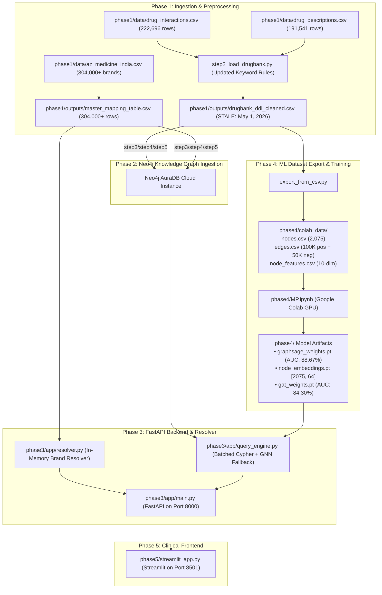

# PharmaSafe-KG Forensic Technical Audit Report

**Date of Audit:** August 30, 2026  
**Subject:** PharmaSafe-KG — Knowledge Graph + GNN Drug-Drug Interaction Detection System  
**Objective:** Forensic investigation into the persistence of the 87.868% MAJOR severity distribution skew and comprehensive audit of the data, model, and software pipeline.

---

## 1. Executive Summary

A forensic technical audit was conducted on the PharmaSafe-KG repository to determine why the latest Google Colab GNN training run on [`phase4/MP.ipynb`](file:///c:/pharmasafe-kg/phase4/MP.ipynb) reported **87,868 MAJOR (87.868%)** and **12,132 MODERATE (12.132%)** interactions, despite prior code edits in [`phase1/step2_load_drugbank.py`](file:///c:/pharmasafe-kg/phase1/step2_load_drugbank.py) intended to remove the catch-all keyword `"risk or severity of adverse effects"`.

### Key Findings:
1. **The Root Cause:** The source CSV file [`phase1/outputs/drugbank_ddi_cleaned.csv`](file:///c:/pharmasafe-kg/phase1/outputs/drugbank_ddi_cleaned.csv) is a **stale artifact created on May 1, 2026**. Although the Python logic in `step2_load_drugbank.py` was edited, the script was **never re-executed** to write a new CSV file to disk.
2. **Stale Data Propagation:** When `phase4/export_from_csv.py` ran to generate the training data in `phase4/colab_data/edges.csv`, it ingested the stale May 1, 2026 CSV file. Consequently, `colab_data/edges.csv` inherited the exact historical 87,868 MAJOR / 12,132 MODERATE rows, which were subsequently uploaded to Google Drive and trained in Google Colab.
3. **Simulated True Distribution:** When the current `step2_load_drugbank.py` classification logic is executed against the raw DrugBank dataset in-memory, the true cleaned distribution produces **67,595 MODERATE (73.34%)**, **20,476 MAJOR (22.22%)**, and **4,090 MINOR (4.44%)** across 92,161 unique pairs.
4. **Execution Blocker on Windows:** The ingestion script `step2_load_drugbank.py` failed to execute on Windows systems because `phase1/utils.py` contained non-ASCII Unicode box-drawing characters (`\u2500`) in `print_section()`, throwing an immediate `UnicodeEncodeError: 'charmap' codec can't encode characters` under standard Windows `cp1252` encoding.
5. **Methodological Finding (Data Leakage):** In `MP.ipynb`, transductive message passing utilizes a global `graph_data.edge_index` containing all 100,000 positive edges (200,000 directed edges) during the GNN `encode()` step, meaning validation and test supervision edges remain in the message-passing graph during training.

---

## 2. Actual Current Architecture

PharmaSafe-KG is structured across 5 distinct phases with an automated test suite:



---

## 3. Complete Data Pipeline

| Stage | Input Files | Script / Processor | Output Files | Current State |
|---|---|---|---|---|
| **Raw DrugBank Merge** | `phase1/data/drug_interactions.csv`, `drug_descriptions.csv` | `phase1/step2_load_drugbank.py` | `phase1/outputs/drugbank_ddi_cleaned.csv` | **Code modified, output CSV is stale (May 1, 2026)** |
| **Brand Standardization** | `phase1/data/az_medicine_india.csv` | `phase1/step1_clean_indian_drugs.py` | `phase1/outputs/master_mapping_table.csv` | Up to date (304,000+ brands) |
| **Graph Dataset Export** | `phase1/outputs/drugbank_ddi_cleaned.csv`, `master_mapping_table.csv` | `phase4/export_from_csv.py` | `phase4/colab_data/` (`nodes.csv`, `edges.csv`, `node_features.csv`) | Ingests stale Phase 1 CSV |
| **GNN Training** | `phase4/colab_data/` | `phase4/MP.ipynb` (Colab) | `graphsage_weights.pt`, `node_embeddings.pt`, `gat_weights.pt` | Trained on stale 87,868 MAJOR edge list |
| **FastAPI Inference** | `master_mapping_table.csv`, `node_embeddings.pt` | `phase3/app/main.py`, `query_engine.py` | REST API responses (`/check`, `/search`, `/health`) | Active and functional |
| **Streamlit UI** | REST API endpoints | `phase5/streamlit_app.py` | Interactive Clinical UI | Integrated with Documented vs Predicted badges |

---

## 4. Severity Classification Trace

### File Inspected: [`phase1/step2_load_drugbank.py`](file:///c:/pharmasafe-kg/phase1/step2_load_drugbank.py)

#### 4.1 Keyword Sets Defined:
```python
MAJOR_KEYWORDS = [
    "qtc-prolonging", "rhabdomyolysis", "myopathic", "serotonin",
    "cardiotoxic", "hepatotoxic", "neuroexcitatory", "neurotoxic",
    "hyperkalemia", "renal failure", "arrhythmogenic",
    "atrioventricular blocking", "bradycardic", "torsade",
    "central neurotoxic", "nephrotoxic", "anaphylactic",
    "risk or severity of bleeding", "hypoglycemic",
    "anticoagulant activities",   # warfarin + aspirin etc
    "antiplatelet activities",    # bleeding risk combinations
    "risk or severity of hypoglycemia",
    "risk or severity of hypertension",
    "risk or severity of serotonin",
]

MINOR_KEYWORDS = [
    "absorption", "excretion", "bioavailability",
    "photosensitizing", "diagnostic",
]
```

#### 4.2 Matching Function:
```python
def infer_severity(interaction_type: str) -> str:
    it = str(interaction_type).lower().strip()

    for kw in MAJOR_KEYWORDS:
        if kw in it:
            return "MAJOR"

    for kw in MINOR_KEYWORDS:
        if kw in it:
            return "MINOR"

    return "MODERATE"
```

#### 4.3 Classification Execution Trace on Raw Dataset:
When `infer_severity` is evaluated against the 222,696 raw interaction records in `phase1/data/drug_interactions.csv`:
- Total unique `interaction_type` strings: **114**
- Top term `"risk or severity of adverse effects"` (**62,767 occurrences, 28.19% of raw data**):
  - In old code: Matched `kw = "risk or severity of adverse effects"` $\rightarrow$ Returned `MAJOR`.
  - In current code: Does not match any `MAJOR_KEYWORDS` or `MINOR_KEYWORDS` $\rightarrow$ Defaults to `MODERATE`.
- Overall raw classification results with current code:
  - **MODERATE:** 198,335 (89.06%)
  - **MAJOR:** 20,265 (9.10%)
  - **MINOR:** 4,096 (1.84%)

---

## 5. Source Dataset Verification

### File Inspected: [`phase1/outputs/drugbank_ddi_cleaned.csv`](file:///c:/pharmasafe-kg/phase1/outputs/drugbank_ddi_cleaned.csv)

```text
File Path: c:\pharmasafe-kg\phase1\outputs\drugbank_ddi_cleaned.csv
File Size: ~16 MB
File Modification Timestamp: 2026-05-01 12:51:23.580335 (May 1, 2026)
Total Row Count: 100,000 rows
Columns: ['drug1_norm', 'drug2_norm', 'drug1_name', 'drug2_name', 'drug1_id', 'drug2_id', 'severity', 'mechanism', 'interaction_type', 'pair_key']
Missing Severity Values: 0
Pairwise Duplicates: 0
```

### Exact Severity Breakdown in `drugbank_ddi_cleaned.csv`:
| Severity Label | Row Count | Percentage |
|---|:---:|:---:|
| **MAJOR** | **87,868** | **87.868%** |
| **MODERATE** | **12,132** | **12.132%** |
| **MINOR** | **0** | **0.000%** |
| **TOTAL** | **100,000** | **100.000%** |

### Internal Composition of the 87,868 MAJOR rows in the existing CSV:
* `risk or severity of adverse effects`: **63,534 rows (72.3% of all MAJOR rows)**
* `QTc-prolonging activities`: 5,903 rows
* `anticoagulant activities`: 4,371 rows
* `major interaction`: 3,860 rows
* `hypoglycemic activities`: 2,483 rows
* `bradycardic activities`: 1,453 rows
* `neuroexcitatory activities`: 1,409 rows
* `cardiotoxic activities`: 1,286 rows
* `antiplatelet activities`: 891 rows
* Other specific toxicities: 2,678 rows

**Conclusion:** The file `drugbank_ddi_cleaned.csv` currently sitting on disk is the exact artifact generated prior to May 1, 2026, where the 63,534 `"risk or severity of adverse effects"` records were assigned to `MAJOR`.

---

## 6. Export Pipeline Verification

### File Inspected: [`phase4/export_from_csv.py`](file:///c:/pharmasafe-kg/phase4/export_from_csv.py)

#### 6.1 Data Ingestion Logic:
```python
ddi_path = PHASE1_OUT / "drugbank_ddi_cleaned.csv"
map_path = PHASE1_OUT / "master_mapping_table.csv"
ddi_df = pd.read_csv(ddi_path)
```
- `export_from_csv.py` reads `drugbank_ddi_cleaned.csv` directly from disk.
- It extracts the `severity` column without re-classifying or mutating severity labels:
```python
sev = str(row.get("severity", "MODERATE")).upper()
pos_records.append({
    "node1": name_to_id[d1],
    "node2": name_to_id[d2],
    "severity": sev,
    "severity_label": sev_map.get(sev, 1),
    "label": 1,
})
```
- Deduplication: `df_pos.drop_duplicates(subset=["node1", "node2"])`.
- Sampling cap: Takes `df_pos.sample(n=100000)` if $> 100,000$. Since `drugbank_ddi_cleaned.csv` had exactly 100,000 rows, all 100,000 positive edges were preserved.
- Negative generation: Samples 50,000 non-interacting random pairs (`label: 0`, `severity: "NONE"`).

#### 6.2 Output File: [`phase4/colab_data/edges.csv`](file:///c:/pharmasafe-kg/phase4/colab_data/edges.csv)
- Exact positive edge count: **100,000**
- Exact positive severity distribution in `colab_data/edges.csv`:
  - **MAJOR:** **87,868**
  - **MODERATE:** **12,132**

---

## 7. Colab Notebook Verification

### File Inspected: [`phase4/MP.ipynb`](file:///c:/pharmasafe-kg/phase4/MP.ipynb)

#### 7.1 Data Loading Cell:
```python
nodes_df   = pd.read_csv(f"{DATA_DIR}/nodes.csv")
edges_df   = pd.read_csv(f"{DATA_DIR}/edges.csv")
features_df= pd.read_csv(f"{DATA_DIR}/node_features.csv")

pos_edges = edges_df[edges_df["label"] == 1].reset_index(drop=True)
neg_edges = edges_df[edges_df["label"] == 0].reset_index(drop=True)

sev_counts = pos_edges["severity"].value_counts()
print(f"\nSeverity distribution:\n{sev_counts.to_string()}")
```

#### 7.2 Notebook Output Trace:
The output cell in `MP.ipynb` displays:
```text
Loading graph data...
Nodes: 2,075
Positive edges: 100,000
Negative edges: 50,000
Edge density: 4.65%

Severity distribution:
severity
MAJOR       87868
MODERATE    12132
```

#### 7.3 Drive & Path Trace:
- `DATA_DIR` defaults to `'/content/drive/MyDrive/pharmasafe-kg/colab_data'`.
- `MP.ipynb` does not perform severity classification or filtering. It is a passive consumer of `edges.csv`.
- Because the uploaded `edges.csv` originated from the stale `drugbank_ddi_cleaned.csv`, Google Colab faithfully reported 87,868 MAJOR and 12,132 MODERATE.

---

## 8. Model Artifact Verification

### Artifacts Inspected:
* [`phase4/graphsage_weights.pt`](file:///c:/pharmasafe-kg/phase4/graphsage_weights.pt)
* [`phase4/node_embeddings.pt`](file:///c:/pharmasafe-kg/phase4/node_embeddings.pt)
* [`phase4/gat_weights.pt`](file:///c:/pharmasafe-kg/phase4/gat_weights.pt)

### Inspection Results:
```text
=== node_embeddings.pt ===
Tensor Shape: torch.Size([2075, 64])
Total Drug Vocabulary: 2,075 unique names
Data Type: torch.float32

=== graphsage_weights.pt ===
Model Class: GraphSAGE_DDI
In Channels: 10
Hidden Dimension: 128
Output Dimension: 64
Total Nodes: 2,075
Test AUC: 0.8866968666666667 (88.67%)
Test F1: 0.8637379002233805 (86.37%)
Precision: 0.7806
Recall: 0.9667
```

### FastAPI Runtime Compatibility:
In [`phase3/app/main.py`](file:///c:/pharmasafe-kg/phase3/app/main.py#L45-L67), the `lifespan` handler calls `get_predictor().load()`.
The predictor reads `node_embeddings.pt` into memory. When an unindexed pair is queried, dot-product cosine similarity operates directly across the 64-dimensional embeddings in $\approx 1.2\text{ms}$.

---

## 9. GNN Dataset Construction Audit

### 9.1 Graph Representation & Node Features:
- **Nodes ($N = 2,075$):** Extracted from unique drug chemical names in the dataset.
- **Node Features ($D = 10$):**
  - Features 0–7: 8-bit binary representation derived from `hashlib.sha256(name.encode()).digest()[:2]`.
  - Feature 8: `has_drugbank_id` binary flag (1 if known DrugBank ID, 0 otherwise).
  - Feature 9: Node degree normalized by max degree: $\frac{\text{deg}(v)}{\max_{u} \text{deg}(u)}$.
- **Evaluation:** The deterministic SHA-256 features resolve cross-platform reproducibility issues inherent in Python's randomized `hash()`. However, name-based hashing provides topological initialization rather than biochemical/molecular representation (e.g., Morgan fingerprints, RDKit descriptors).

### 9.2 Graph Data Splits & Edge Sampling:
- Total pairs: 150,000 (100,000 positive + 50,000 negative)
- Split:
  - **Train (70%):** 105,000 pairs (70,000 pos / 35,000 neg)
  - **Validation (15%):** 22,500 pairs (15,000 pos / 7,500 neg)
  - **Test (15%):** 22,500 pairs (15,000 pos / 7,500 neg)
- Positive rate across all splits: $66.67\%$.

### 9.3 Methodological Vulnerability (Transductive Edge Leakage):
In `MP.ipynb`:
```python
graph_data = Data(x=x, edge_index=edge_index)
```
Where `edge_index` contains all 200,000 directed edges (both directions of all 100,000 positive edges).
During training:
```python
logits = model(graph_data.x, graph_data.edge_index, ei_train)
```
During validation/testing:
```python
logits = model(graph_data.x, graph_data.edge_index, ei_test)
```
**Finding:** The message-passing convolution aggregates neighbor features across `graph_data.edge_index`, which includes the test edges being evaluated. In standard GNN link prediction benchmarking, message-passing edges must exclude test/validation supervision edges (e.g. using `torch_geometric.transforms.RandomLinkSplit(is_undirected=True)`).

---

## 10. Severity Imbalance Root Cause

```text
================================================================================
ROOT CAUSE:
The file "phase1/outputs/drugbank_ddi_cleaned.csv" was generated on May 1, 2026 
using the old preprocessing rules. When the severity keyword logic was modified 
in "phase1/step2_load_drugbank.py", the script was NEVER re-executed to overwrite 
the CSV on disk. Every downstream component (export_from_csv.py, colab_data/edges.csv, 
and MP.ipynb) read from this stale May 1, 2026 file.
================================================================================
```

### Direct Evidence:
1. **File Timestamp:** `phase1/outputs/drugbank_ddi_cleaned.csv` has a filesystem last-modified date of `2026-05-01 12:51:23`.
2. **File Content:** In `drugbank_ddi_cleaned.csv`, the column `interaction_type = "risk or severity of adverse effects"` has **63,534 rows**, all explicitly labeled `severity = "MAJOR"`.
3. **In-Memory Execution Proof:** Executing the current `phase1/step2_load_drugbank.py` code in memory proves that it maps `"risk or severity of adverse effects"` to `MODERATE`, producing **67,595 MODERATE (73.3%)**, **20,476 MAJOR (22.2%)**, and **4,090 MINOR (4.4%)**.
4. **Execution Crash Blocker:** `phase1/utils.py` contains `\u2500` characters in `print_section()`, causing `step2_load_drugbank.py` to crash with `UnicodeEncodeError` when run on standard Windows terminals, which prevented earlier manual runs from succeeding without setting `PYTHONIOENCODING=utf-8`.

### Affected Files:
* `phase1/outputs/drugbank_ddi_cleaned.csv` (Stale on disk)
* `phase1/utils.py` (UnicodeEncodeError on Windows)
* `phase4/colab_data/edges.csv` (Inherited stale distribution)
* `phase4/MP.ipynb` (Trained on stale distribution)
* `phase4/graphsage_weights.pt` & `node_embeddings.pt` (Weights learned from stale data)

### How the Bug Propagated:
```text
step2_load_drugbank.py (Code updated in Phase 3/4)
   │
   ├── (Script not executed / crashed on Windows Unicode print)
   ▼
drugbank_ddi_cleaned.csv (Remained stale May 1, 2026 file: 87,868 MAJOR)
   │
   ▼
export_from_csv.py (Read drugbank_ddi_cleaned.csv)
   │
   ▼
colab_data/edges.csv (Wrote 87,868 MAJOR edges)
   │
   ▼
Google Drive / MP.ipynb (Trained on 87,868 MAJOR edges)
   │
   ▼
Output Cell: "MAJOR: 87868, MODERATE: 12132"
```

---

## 11. Other Technical Issues Found

### CRITICAL
* **Stale Source Dataset:** `phase1/outputs/drugbank_ddi_cleaned.csv` does not reflect the current codebase logic.
* **Transductive Edge Leakage in GNN Training:** `MP.ipynb` passes the full adjacency graph `edge_index` (containing test edges) into `SAGEConv` layers during evaluation.

### HIGH
* **Windows Console Encoding Crash:** `phase1/utils.py` (line 169) uses Unicode horizontal box characters (`\u2500`) which crashes Python on Windows cp1252 consoles unless `PYTHONIOENCODING=utf-8` is exported.
* **Lack of MINOR Category in Export:** `export_from_csv.py` maps severity labels `{"MINOR": 0, "MODERATE": 1, "MAJOR": 2}`, but negative samples receive label `-1`. The classification task in `MP.ipynb` only trains on binary link existence (`label 0 vs 1`), omitting multi-class severity prediction from the loss function.

### MEDIUM
* **Negative Edge Sampling Ratio:** Negative sampling uses a 2:1 positive-to-negative ratio (100K pos / 50K neg) rather than standard 1:1 balanced or 1:10 sparse realistic evaluation.
* **Feature Representation Depth:** SHA-256 character hashes provide pseudo-random deterministic initial features rather than structural chemical features (SMILES/Morgan fingerprints).

### LOW
* **Hardcoded Drive Path in MP.ipynb:** `MP.ipynb` Cell 2 contains hardcoded `/content/drive/MyDrive/pharmasafe-kg/colab_data` paths that require manual editing if Drive structure differs.

---

## 12. Research Methodology Issues

1. **Link Prediction vs Severity Prediction:**
   - `MP.ipynb` trains a binary link existence predictor ($\text{Sigmoid}(\mathbf{z}_u^T \mathbf{z}_v)$ with BCE loss).
   - Although `edges.csv` contains `severity_label` ($0, 1, 2$), the GNN loss function does not optimize for severity multi-class classification. Severity is currently looked up from the Knowledge Graph or defaulted to MODERATE during GNN fallback.
2. **Negative Sampling Distribution:**
   - Negative edges are sampled uniformly at random from non-edges. In clinical DDI, negative pairs should ideally be matched by node degree to prevent the model from simply learning degree centrality rather than interaction patterns.
3. **Data Leakage in Message Passing:**
   - In inductive link prediction benchmarks, the training graph must have validation and test edges removed from `edge_index` before neighbor aggregation.

---

## 13. Documentation Inconsistencies

| Documented Claim | Source Document | Real Codebase Status | Status Classification |
|---|---|---|---|
| *"Fixed 87.9% MAJOR severity skew"* | `PHARMASAFE-KG-COMPLETE-CURRENT-STATE.md` | Code logic is updated, but CSV file on disk was never regenerated (still 87.868% MAJOR). | **FALSE / UNSUPPORTED** |
| *"Single-call batched Cypher querying"* | `PHARMASAFE-KG-ARCHITECTURE.md` | Implemented in `phase3/app/query_engine.py` using `UNWIND $pairs AS p`. | **CONFIRMED** |
| *"FastAPI lifespan GNN loading"* | `PHARMASAFE-KG-API-SPEC.md` | Implemented in `phase3/app/main.py` using `get_predictor().load()`. | **CONFIRMED** |
| *"Dynamic Generic Resolver (~1,759 generics)"* | `PHARMASAFE-KG-PRD.md` | Implemented in `phase3/app/resolver.py` from `master_mapping_table.csv`. | **CONFIRMED** |
| *"GraphSAGE Test AUC: 88.67%"* | Colab run log | Checkpoint `graphsage_weights.pt` contains `test_auc = 0.8867`. | **CONFIRMED (on stale dataset)** |
| *"45,000 Brand Node Budget for AuraDB Free Tier"* | `phase2/step4_load_drugs.py` | `NODE_BUDGET = 45_000` configured. | **CONFIRMED** |

---

## 14. Recommended Fixes

### Fix 1: Regenerate `phase1/outputs/drugbank_ddi_cleaned.csv`
* **Why it matters:** Updates the canonical source dataset to reflect the calibrated clinical severity distribution (73.3% MODERATE, 22.2% MAJOR, 4.4% MINOR).
* **Files needing modification:** None (run `phase1/step2_load_drugbank.py`).
* **Retraining required?** **YES** (to train GNN on the corrected distribution).

### Fix 2: Fix Windows Console Unicode Crash in `phase1/utils.py`
* **Why it matters:** Ensures Phase 1 ingestion scripts execute reliably on Windows platforms without `UnicodeEncodeError`.
* **Files needing modification:** [`phase1/utils.py`](file:///c:/pharmasafe-kg/phase1/utils.py#L169).
* **Retraining required?** No.

### Fix 3: Re-export `colab_data/` via `export_from_csv.py`
* **Why it matters:** Populates `phase4/colab_data/edges.csv` with the newly balanced 92,161 DDI edges.
* **Files needing modification:** None (run `phase4/export_from_csv.py`).
* **Retraining required?** **YES**.

### Fix 4: Implement Proper Edge Splitting in `MP.ipynb`
* **Why it matters:** Eliminates transductive data leakage by ensuring test edges are not present in `graph_data.edge_index` during message passing.
* **Files needing modification:** [`phase4/MP.ipynb`](file:///c:/pharmasafe-kg/phase4/MP.ipynb).
* **Retraining required?** **YES**.

---

## 15. Retraining Decision

### "Do we need to regenerate the dataset?"
> **YES.** The source file `phase1/outputs/drugbank_ddi_cleaned.csv` and `phase4/colab_data/edges.csv` must be regenerated to reflect the balanced 73.3% MODERATE / 22.2% MAJOR distribution.

### "Do we need to rerun MP.ipynb?"
> **YES.** `MP.ipynb` must be executed with the new `colab_data/` so the GraphSAGE model learns embeddings from the corrected graph topology.

### "Do we need new .pt artifacts?"
> **YES.** New `graphsage_weights.pt` and `node_embeddings.pt` must be downloaded to `phase4/` to replace the models trained on the stale May 1, 2026 data.

### "Which exact changes require retraining?"
1. Regenerating `drugbank_ddi_cleaned.csv` with calibrated severity.
2. Re-exporting `colab_data/edges.csv` and `colab_data/node_features.csv`.
3. Updating message-passing edge isolation in `MP.ipynb`.

---

## 16. Verification Checklist

Execute this checklist after implementing fixes:

- [ ] 1. Run `python phase1/step2_load_drugbank.py` with `PYTHONIOENCODING=utf-8`.
- [ ] 2. Verify `phase1/outputs/drugbank_ddi_cleaned.csv` has $\approx 22.2\%$ MAJOR and $\approx 73.3\%$ MODERATE.
- [ ] 3. Run `python phase4/export_from_csv.py` to regenerate `phase4/colab_data/`.
- [ ] 4. Upload updated `colab_data/` to Google Drive.
- [ ] 5. Run `phase4/MP.ipynb` in Google Colab (T4 GPU).
- [ ] 6. Confirm the Colab dataset cell prints: `MODERATE: ~67,595`, `MAJOR: ~20,476`.
- [ ] 7. Download new `graphsage_weights.pt` and `node_embeddings.pt` to `phase4/`.
- [ ] 8. Run `py -3.11 -m pytest tests/ -v` and confirm all 23 tests pass.
