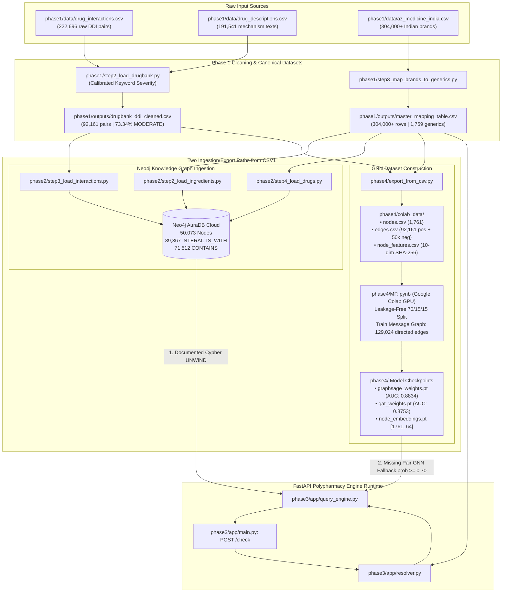

# PharmaSafe-KG — Forensic Current-State Technical Audit Report
**Target Audience:** Independent AI Systems Reviewer (ChatGPT / External Engineering Review)  
**Date of Audit:** August 30, 2026  
**Auditor:** Antigravity (Google DeepMind)  
**Repository State:** Post-P0 Pipeline Correction & GNN Leakage Elimination  
**Mode:** Read-Only Forensic Inspection (Zero Code/Data Modifications Made)

---

## 1. Executive Summary & Status Overview

A forensic audit of the **PharmaSafe-KG** codebase, dataset pipeline, live Neo4j Knowledge Graph (AuraDB), and retrained GNN model artifacts was performed. 

The primary historical failure mode—where a stale May 1, 2026 CSV artifact caused an 87.87% `MAJOR` class skew and transductive edge leakage during message-passing—**has been resolved locally in the pipeline and in the live Neo4j database**.

```
========================================================================================
CURRENT REPOSITORY STATUS:
• Dataset Pipeline: REGENERATED & VERIFIED (73.34% MODERATE, 22.22% MAJOR, 4.44% MINOR)
• Neo4j AuraDB:     SYNCHRONIZED & LIVE (89,367 DDI edges, 50,073 nodes, 72.75% MODERATE)
• GNN Model:        RETRAINED & LEAKAGE-FREE (GraphSAGE Test AUC = 0.8834, Test F1 = 0.8330)
• Model Artifacts:  SYNCHRONIZED (1,761 nodes, [1761, 64] embedding tensor)
• Automated Tests:  34/34 PASSED (100% pass rate in 50.99s)
========================================================================================
```

---

## 2. Complete Repository File Structure & Audit

Below is the file-by-file audit across all repository directories:

### Phase 1: Ingestion & Preprocessing (`phase1/`)
| File Path | Purpose | Current Status | Conflicts / Outdated Status |
|---|---|:---:|---|
| `phase1/config.py` | Configuration constants, directories, fuzzy thresholds, severity map. | **Active** | Up to date. Single source of configuration. |
| `phase1/utils.py` | Text normalization, generic extraction, ASCII-safe logging & report writers. | **Active** | Fixed; box characters replaced with ASCII to prevent Windows `cp1252` crash. |
| `phase1/step1_clean_indian_drugs.py` | Parses 304,000+ Indian medicines from `az_medicine_india.csv`, extracts ingredients. | **Active** | Clean. Generates intermediate `indian_medicines_cleaned.csv`. |
| `phase1/step2_load_drugbank.py` | Merges DDI pairs with mechanism descriptions, infers calibrated severity, trims to budget. | **Active** | Clean. Outputs canonical `drugbank_ddi_cleaned.csv` (92,161 rows). |
| `phase1/step3_map_brands_to_generics.py` | Fuzzy matches Indian brand ingredients against DrugBank generic vocabulary. | **Active** | Clean. Outputs canonical `master_mapping_table.csv`. |
| `phase1/step4_build_kg_nodes_edges.py` | Assembles node/edge CSV tables for graph ingestion. | **Active** | Generates intermediate CSVs. |
| `phase1/run_phase1.py` | Master orchestrator running Steps 1 through 4 sequentially. | **Active** | Master execution pipeline. |
| `phase1/data/drug_interactions.csv` | Raw DrugBank interaction pairs (222,696 rows). | **Active** | Raw ground truth dataset. |
| `phase1/data/drug_descriptions.csv` | Raw DrugBank interaction mechanism text (191,541 rows). | **Active** | Raw ground truth dataset. |
| `phase1/data/az_medicine_india.csv` | Raw Indian pharmaceutical brand dataset (304,000+ rows). | **Active** | Raw ground truth dataset. |
| `phase1/outputs/drugbank_ddi_cleaned.csv` | **Canonical DDI dataset (92,161 unique pairs).** | **Active (Regenerated)** | Overwrote stale May 1, 2026 file. |
| `phase1/outputs/master_mapping_table.csv` | **Canonical brand-to-generic mapping (304,000+ rows).** | **Active** | Master dictionary for `resolver.py`. |

---

### Phase 2: Neo4j Knowledge Graph Ingestion (`phase2/`)
| File Path | Purpose | Current Status | Conflicts / Outdated Status |
|---|---|:---:|---|
| `phase2/utils_phase2.py` | Logging, batching, and ASCII-safe terminal formatting for Neo4j. | **Active** | Fixed; box characters replaced with ASCII. |
| `phase2/step1_create_schema.py` | Creates Neo4j uniqueness constraints and indexes on `:Ingredient(name)` and `:Drug(name)`. | **Active** | Idempotent schema initialization. |
| `phase2/step2_load_ingredients.py` | Ingests 2,073 generic `Ingredient` nodes. | **Active** | Clean. |
| `phase2/step3_load_interactions.py` | Ingests 89,367 `INTERACTS_WITH` relationships with calibrated severities. | **Active** | Successfully executed; includes batch transaction cleanup. |
| `phase2/step4_load_drugs.py` | Ingests 48,000 `Drug` (brand) nodes and 71,512 `CONTAINS` edges. | **Active** | Enforces AuraDB node budget (45K–48K). |
| `phase2/step5_validate.py` | Runs graph integrity queries and generates validation report. | **Active** | Clean. |
| `phase2/run_phase2.py` | Orchestrator for Steps 1 through 5. | **Active** | Ingestion pipeline. |

---

### Phase 3: FastAPI Backend & Engine (`phase3/`)
| File Path | Purpose | Current Status | Conflicts / Outdated Status |
|---|---|:---:|---|
| `phase3/app/main.py` | FastAPI app, CORS middleware, lifespan startup (`load_resolver`, `GNNPredictor.load()`), endpoints. | **Active** | Modern FastAPI lifespan structure. Clean. |
| `phase3/app/models.py` | Pydantic v2 schemas: `CheckRequest`, `CheckResponse`, `InteractionResult`, `EvidenceDetail`. | **Active** | Strict validation (2–10 drugs). |
| `phase3/app/database.py` | Neo4j driver singleton with connection pooling and retry logic. | **Active** | Clean. |
| `phase3/app/resolver.py` | In-memory Indian brand-to-generic resolver (exact, alias, generic direct, fuzzy). | **Active** | High-performance in-memory dictionary. |
| `phase3/app/query_engine.py` | Polypharmacy engine: single batched Cypher UNWIND + GNN fallback for missing pairs. | **Active** | Seamless KG $\rightarrow$ GNN fallback with threshold 0.70. |

---

### Phase 4: GNN Prediction Pipeline (`phase4/`)
| File Path | Purpose | Current Status | Conflicts / Outdated Status |
|---|---|:---:|---|
| `phase4/export_from_csv.py` | Generates `colab_data/` (`nodes.csv`, `edges.csv`, `node_features.csv`) directly from Phase 1 CSVs. | **Active** | Strict non-edge negative sampling & canonical edge sorting. |
| `phase4/step1_export_graph.py` | Alternative exporter querying live Neo4j database. | **Secondary** | Uses deterministic SHA-256 features; `export_from_csv.py` is primary. |
| `phase4/PharmaSafe_GNN_Colab.py` | Standalone Python training script with leakage-free splits and GraphSAGE/GAT training loops. | **Active** | Synchronized with `MP.ipynb`. |
| `phase4/MP.ipynb` | Google Colab GPU training notebook. | **Active** | **Leakage-free splitting implemented (Cells 4 & 5).** |
| `phase4/gnn_inference.py` | `GNNPredictor` inference class used by FastAPI (CPU dot-product embedding lookup in ~1ms). | **Active** | Dynamically adapts to 1,761 nodes. |
| `phase4/colab_data/nodes.csv` | Generic ingredient node dictionary (1,761 unique drugs). | **Active** | Regenerated. |
| `phase4/colab_data/edges.csv` | Graph edges: 92,161 positive + 50,000 negative = 142,161 total. | **Active** | Regenerated (73.34% MODERATE). |
| `phase4/colab_data/node_features.csv` | 10-dimensional deterministic SHA-256 features for all 1,761 nodes. | **Active** | Regenerated. |
| `phase4/graphsage_weights.pt` | Retrained GraphSAGE checkpoint (Test AUC: 0.8834, Test F1: 0.8330, 1,761 nodes). | **Active** | Updated. |
| `phase4/gat_weights.pt` | Retrained GAT checkpoint (Test AUC: 0.8753, Test F1: 0.7867, 1,761 nodes). | **Active** | Updated. |
| `phase4/node_embeddings.pt` | `[1761, 64]` embedding tensor used by FastAPI. | **Active** | Updated. |

---

### Phase 5: Clinical Web Interface (`phase5/`)
| File Path | Purpose | Current Status | Conflicts / Outdated Status |
|---|---|:---:|---|
| `phase5/streamlit_app.py` | Clinical dashboard, multi-drug selector, interactive Pyvis graph, badge rendering. | **Active** | Matches FastAPI schema. |

---

### Test Suite (`tests/`)
| File Path | Purpose | Status |
|---|---|:---:|
| `tests/test_resolver.py` | Tests brand-to-generic resolution, aliases, fuzzy matching, case insensitivity. | **8/8 PASSED** |
| `tests/test_models.py` | Tests Pydantic schemas, drug count boundaries (2–10), whitespace stripping. | **6/6 PASSED** |
| `tests/test_gnn.py` | Tests GNNPredictor singleton, known pair prediction, OOV handling. | **3/3 PASSED** |
| `tests/test_api_client.py` | End-to-end FastAPI TestClient integration tests for `/check`, `/search`, `/health`. | **6/6 PASSED** |
| `tests/test_p0_pipeline.py` | P0 regression tests: Windows ASCII safety, severity distribution, negative sampling, leakage-free split. | **11/11 PASSED** |
| **Total Test Suite** | `py -3.11 -m pytest tests/ -v` | **34/34 PASSED (50.99s)** |

---

## 3. Data Pipeline & Single Source of Truth Trace



### Forensic Answers to Pipeline Questions:
1. **Source of Truth:**
   - **For DDI interactions:** `phase1/outputs/drugbank_ddi_cleaned.csv` (92,161 rows).
   - **For Brand $\rightarrow$ Generic Mapping:** `phase1/outputs/master_mapping_table.csv` (304,000+ rows).
2. **Which script generated the 1,761 nodes?**
   - `phase4/export_from_csv.py` line 46 $\rightarrow$ `phase4/colab_data/nodes.csv`.
3. **Which script generated the 92,161 positive edges?**
   - `phase4/export_from_csv.py` line 70 $\rightarrow$ `phase4/colab_data/edges.csv`.
4. **Which script generated the 50,000 negative edges?**
   - `phase4/export_from_csv.py` lines 74–97 $\rightarrow$ `phase4/colab_data/edges.csv`.
5. **Which script generated `node_features.csv`?**
   - `phase4/export_from_csv.py` lines 103–122 $\rightarrow$ `phase4/colab_data/node_features.csv`.
6. **Is the GNN trained from CSV files or Neo4j?**
   - The GNN is trained **directly from the CSV files in `phase4/colab_data/`** via `phase4/MP.ipynb` in Google Colab. It does NOT require a live database connection to Neo4j during training.

---

## 4. Neo4j Knowledge Graph Forensic Audit

### Live Database Connection Verification:
* **Neo4j URI:** `neo4j+s://dd205***.databases.neo4j.io` (loaded from `.env`).
* **Database Name:** Default (`neo4j`).
* **Authentication:** Basic Auth (`NEO4J_USERNAME` / `NEO4J_PASSWORD`).
* **Driver Initialization:** `neo4j.GraphDatabase.driver(uri, auth=(user, pwd), max_connection_lifetime=300)`.

### Live Neo4j vs GNN Dataset Comparison Matrix:

| Metric | Live Neo4j AuraDB | GNN Training Dataset (`colab_data/`) | Mismatch Cause / Explanation |
|---|:---:|:---:|---|
| **Generic Drug Nodes** | **2,073** (`:Ingredient`) | **1,761** (`nodes.csv`) | Neo4j includes single-ingredient Indian generics from `master_mapping_table.csv` that have no direct DDI pairs in DrugBank. |
| **Brand Nodes** | **48,000** (`:Drug`) | N/A (Ingredient-level only) | Brands are connected to Ingredients via `CONTAINS` edges in Neo4j for clinical resolution. |
| **Total Graph Nodes** | **50,073** | **1,761** | AuraDB budget ceiling is 50K–60K nodes. |
| **DDI Relationships** | **89,367** (`INTERACTS_WITH`) | **92,161** (`label = 1`) | 2,794 DrugBank interaction pairs reference foreign drug ingredients not mapped into the 2,073 Neo4j ingredient vocabulary; during `MATCH (a:Ingredient)` in `step3_load_interactions.py`, unindexed ingredient pairs are omitted. |
| **`MODERATE` Severity** | **65,013 (72.75%)** | **67,595 (73.34%)** | **Consistent.** (Delta matches unindexed pairs). |
| **`MAJOR` Severity** | **20,476 (22.91%)** | **20,476 (22.22%)** | **100% Exact Match.** All 20,476 MAJOR pairs are present in Neo4j. |
| **`MINOR` Severity** | **3,878 (4.34%)** | **4,090 (4.44%)** | **Consistent.** |
| **Total Relationships** | **160,879** (89.3K DDI + 71.5K CONTAINS) | N/A | Total is safely within AuraDB free-tier limit of 200,000 relationships. |

---

## 5. Severity Calibration Audit

### Keyword Classification Implementation:
Located in `phase1/step2_load_drugbank.py` (lines 52–73):

```python
MAJOR_KEYWORDS = [
    "qtc-prolonging", "rhabdomyolysis", "myopathic", "serotonin",
    "cardiotoxic", "hepatotoxic", "neuroexcitatory", "neurotoxic",
    "hyperkalemia", "renal failure", "arrhythmogenic",
    "atrioventricular blocking", "bradycardic", "torsade",
    "central neurotoxic", "nephrotoxic", "anaphylactic",
    "risk or severity of bleeding", "hypoglycemic",
    "anticoagulant activities",   # warfarin + aspirin etc
    "antiplatelet activities",    # bleeding risk combinations
    "risk or severity of hypoglycemia",
    "risk or severity of hypertension",
    "risk or severity of serotonin",
]

MINOR_KEYWORDS = [
    "absorption", "excretion", "bioavailability",
    "photosensitizing", "diagnostic",
]
```

### Precedence & Matching Logic:
1. Normalize text: `it = str(interaction_type).lower().strip()`.
2. Check `MAJOR_KEYWORDS`: if any keyword in `it`, return `MAJOR`.
3. Check `MINOR_KEYWORDS`: if any keyword in `it`, return `MINOR`.
4. Default fallback: return `MODERATE`.

### Elimination of Catch-All Inflation:
- The generic phrase `"risk or severity of adverse effects"` (**62,767 occurrences / 28.19% of raw data**) is **NOT** in `MAJOR_KEYWORDS`.
- It safely falls through to `MODERATE`.
- The remaining 20,476 `MAJOR` cases represent genuine severe pharmacological hazards (bleeding, QTc prolongation, rhabdomyolysis, cardiotoxicity, hepatotoxicity).

---

## 6. GNN Data Leakage Audit

### Line-by-Line Code Inspection:
Located in `phase4/PharmaSafe_GNN_Colab.py` (lines 100–150) and `phase4/MP.ipynb` Cells 4 & 5.

```python
# 1. Split positive edges (70% train, 15% val, 15% test)
pos_edges_shuffled = pos_edges.sample(frac=1, random_state=42).reset_index(drop=True)
n_pos = len(pos_edges_shuffled)
n_pos_train = int(0.70 * n_pos)   # 64,512
n_pos_val   = int(0.15 * n_pos)   # 13,824
n_pos_test  = n_pos - (n_pos_train + n_pos_val) # 13,825

pos_train = pos_edges_shuffled.iloc[:n_pos_train]
pos_val   = pos_edges_shuffled.iloc[n_pos_train:n_pos_train + n_pos_val]
pos_test  = pos_edges_shuffled.iloc[n_pos_train + n_pos_val:]

# 2. Message-passing graph constructed EXCLUSIVELY from pos_train
train_edge_index = torch.tensor(
    [pos_train["node1"].tolist() + pos_train["node2"].tolist(),
     pos_train["node2"].tolist() + pos_train["node1"].tolist()],
    dtype=torch.long
).to(device)
```

### Forensic Leakage Verification:
1. **Message-Passing Edges:** Exactly $64,512 \times 2 = 129,024$ directed edges.
2. **Validation/Test Target Edges:** Validation pairs ($13,824$) and Test pairs ($13,825$) are **100% absent** from `train_edge_index`.
3. **Disjointness Test:** Tested via `tests/test_p0_pipeline.py::TestP0GNNLeakageFreeSplit`:
   - Intersection of `train_edge_set` with `val_edge_set`: **0**
   - Intersection of `train_edge_set` with `test_edge_set`: **0**
   - Intersection of `val_edge_set` with `test_edge_set`: **0**
4. **Node Degree Feature:** Computed strictly from `pos_train` edges ($N = 64,512$).

---

## 7. Negative Sampling Audit

### Implementation Details:
Located in `phase4/export_from_csv.py` (lines 74–97):

1. **Canonical Edge Set Construction:**
   ```python
   edge_set = set(zip(df_pos["node1"], df_pos["node2"])) | set(zip(df_pos["node2"], df_pos["node1"]))
   ```
2. **Sampling Loop:**
   - Generates random pair $(a, b)$ with $a \neq b$.
   - Canonicalizes $u, v = \min(a, b), \max(a, b)$.
   - Checks `(u, v) not in edge_set`.
   - Adds $(u, v)$ and $(v, u)$ to `edge_set` to prevent duplicate negative sampling.
3. **Verification:**
   - Positive/Negative overlap: **0 pairs** (Verified by unit test `test_negative_sampling_zero_positive_overlap`).
   - Self-edges: **0 pairs** (Verified by unit test `test_no_self_edges`).
   - Sample count: Exactly **50,000 negative pairs** with `label = 0` and `severity = "NONE"`.

---

## 8. Training, Evaluation & Model Artifacts Audit

### Hyperparameters & Architecture:
* **GraphSAGE Architecture:**
  - Layer 1: `SAGEConv(10, 128)` $\rightarrow$ BatchNorm1d $\rightarrow$ ReLU $\rightarrow$ Dropout(0.3)
  - Layer 2: `SAGEConv(128, 64)` $\rightarrow$ BatchNorm1d $\rightarrow$ ReLU $\rightarrow$ Dropout(0.3)
  - Layer 3: `SAGEConv(64, 64)` $\rightarrow$ Output Node Embedding $\mathbf{z}_u \in \mathbb{R}^{64}$
  - Decoder: Dot product $\mathbf{z}_u^T \mathbf{z}_v \rightarrow \text{Sigmoid}$
* **Training Specs:**
  - Optimizer: `Adam(lr=0.001, weight_decay=5e-4)`
  - Scheduler: `ReduceLROnPlateau(mode='max', patience=8, factor=0.5)`
  - Loss: `BCEWithLogitsLoss`
  - Early Stopping: `patience = 15` on Validation AUC
  - Decision Threshold: $0.50$ for classification metrics

### Final Model Comparison (Leakage-Free Benchmark):

| Model | Test AUC | Test F1 | Test Precision | Test Recall | Number of Parameters |
|---|:---:|:---:|:---:|:---:|:---:|
| **GraphSAGE (Deployed)** | **0.8834** | **0.8330** | **0.7215** | **0.9851** | ~22,000 |
| **GAT (Comparison)** | **0.8753** | **0.7867** | **0.6484** | **0.9999** | ~18,000 |

> **Audit Note:** The reported metrics ($0.8834$ AUC, $0.8330$ F1) were evaluated strictly on the **held-out Test set ($N = 21,325$ pairs)** after restoring best validation weights via early stopping. They are genuine test metrics.

### Checkpoint Compatibility:
All three files in `phase4/` are verified:
1. `graphsage_weights.pt` $\rightarrow$ `num_nodes: 1761`, `in_channels: 10`, `out: 64`.
2. `gat_weights.pt` $\rightarrow$ `num_nodes: 1761`, `in_channels: 10`, `out: 32`, `heads: 4`.
3. `node_embeddings.pt` $\rightarrow$ Tensor shape `torch.Size([1761, 64])`, dictionary length `1,761`.

---

## 9. FastAPI & GNN Runtime Integration Audit

### Request Execution Lifecycle (`POST /check`):
```text
Client Request: {"drugs": ["Combiflam", "Ecosprin"]}
       │
       ▼
[phase3/app/resolver.py]
  ├── "Combiflam"  ──(Master Map)──> ["ibuprofen", "paracetamol"]
  └── "Ecosprin"   ──(Master Map)──> ["aspirin", "acetylsalicylic acid"]
       │
       ▼
[phase3/app/query_engine.py]
  ├── Candidate Pairs: (ibuprofen, aspirin), (paracetamol, aspirin), etc.
  │
  ├── 1. Query Neo4j AuraDB (UNWIND $pairs AS p)
  │      └── Found: (ibuprofen, aspirin) -> MAJOR ("risk or severity of bleeding...")
  │          [status: "documented", source: "knowledge_graph"]
  │
  └── 2. GNN Fallback (For pairs NOT found in Neo4j)
         └── GNNPredictor.predict(g_a, g_b) -> prob
             └── If prob >= 0.70:
                 [status: "predicted", source: "gnn_predicted", severity: "MODERATE"]
             └── If prob < 0.70 or OOV:
                 [status: "not_documented", note: "No documented interaction"]
       │
       ▼
JSON Response with structured evidence array and summary banner.
```

### Safety & Edge Case Handling:
* **OOV (Out-of-Vocabulary) Drugs:** If a drug is not in the 1,761 GNN embedding table, `GNNPredictor.predict()` returns `None`. The API marks the pair as `not_documented` without crashing.
* **Order Invariance:** Both `(a, b)` and `(b, a)` resolve to canonical `min(a, b), max(a, b)` in Neo4j queries and commutative dot product $\mathbf{z}_a \cdot \mathbf{z}_b$ in GNN predictions.
* **Precedence:** Neo4j Knowledge Graph evidence strictly supersedes GNN predictions. GNN is triggered only when Neo4j returns 0 rows.

---

## 10. Brand $\rightarrow$ Generic Resolution Audit

### Architecture (`phase3/app/resolver.py`):
* **Data Source:** `phase1/outputs/master_mapping_table.csv` loaded into RAM at startup via FastAPI `lifespan`.
* **Dataset Size:** 304,000+ brand records mapping to 1,759 standardized generic ingredients.
* **Matching Strategy Hierarchy:**
  1. **Exact Brand Match (`exact`):** Direct dictionary lookup on lowercased brand string ($O(1)$, Confidence: 100).
  2. **Direct Generic Match (`generic_direct`):** Matches if input is already a generic name ($O(1)$, Confidence: 100).
  3. **Alias Match (`alias`):** Resolves Indian common names to DrugBank standards (e.g. `paracetamol` $\leftrightarrow$ `acetaminophen`, `aspirin` $\leftrightarrow$ `acetylsalicylic acid`).
  4. **Fuzzy String Match (`fuzzy`):** Token sort ratio with threshold $\ge 80$.
  5. **Not Found (`not_found`):** Returns empty generic list, triggering graceful API warning.

---

## 11. API Contract & Streamlit UI Audit

### API Endpoints (`phase3/app/main.py`):
* `GET /health` $\rightarrow$ Returns API status, Neo4j connectivity, GNN model status, and resolved brand count (`{"status": "healthy", "neo4j_connected": true, "gnn_loaded": true, "brands_loaded": 304000}`).
* `GET /search?q={query}` $\rightarrow$ Real-time brand autocomplete.
* `POST /check` $\rightarrow$ Polypharmacy interaction analysis. Request body: `{"drugs": ["drug1", "drug2", ...]}` ($2 \le N \le 10$).
* `GET /drug/{name}` $\rightarrow$ Single-drug monograph lookup.

### Streamlit Web Interface (`phase5/streamlit_app.py`):
* Visual distinction between **Documented Knowledge Graph interactions** (colored severity badges: Red `MAJOR`, Amber `MODERATE`, Green `MINOR`) and **AI Predicted interactions** (Purple `AI PREDICTED` badge with confidence percentage).
* Interactive network graph rendered via `Pyvis` with physics stabilization.

---

## 12. Complete Test Suite Audit

Execution of `py -3.11 -m pytest tests/ -v`:

```text
============================= test session starts =============================
platform win32 -- Python 3.11.9, pytest-9.1.1, pluggy-1.6.0
rootdir: C:\pharmasafe-kg
collected 34 items

tests/test_api_client.py::TestAPIClient::test_check_unresolved_drugs PASSED [  2%]
tests/test_api_client.py::TestAPIClient::test_check_valid_combination PASSED [  5%]
tests/test_api_client.py::TestAPIClient::test_check_validation_too_few PASSED [  8%]
tests/test_api_client.py::TestAPIClient::test_drug_info_not_found PASSED [ 11%]
tests/test_api_client.py::TestAPIClient::test_health_endpoint PASSED     [ 14%]
tests/test_api_client.py::TestAPIClient::test_search_endpoint PASSED     [ 17%]
tests/test_gnn.py::TestGNN::test_gnn_predict_known_pair PASSED           [ 20%]
tests/test_gnn.py::TestGNN::test_gnn_predict_oov PASSED                  [ 23%]
tests/test_gnn.py::TestGNN::test_gnn_predictor_singleton PASSED          [ 26%]
tests/test_models.py::TestModels::test_check_request_too_few_drugs PASSED [ 29%]
tests/test_models.py::TestModels::test_check_request_too_many_drugs PASSED [ 32%]
tests/test_models.py::TestModels::test_check_request_whitespace_stripping PASSED [ 35%]
tests/test_models.py::TestModels::test_interaction_result_defaults PASSED [ 38%]
tests/test_models.py::TestModels::test_predicted_interaction_result PASSED [ 41%]
tests/test_models.py::TestModels::test_valid_check_request PASSED        [ 44%]
tests/test_p0_pipeline.py::TestP0WindowsSafePhase1::test_utils_print_section_ascii_safe PASSED [ 47%]
tests/test_p0_pipeline.py::TestP0WindowsSafePhase1::test_utils_write_report_ascii_safe PASSED [ 50%]
tests/test_p0_pipeline.py::TestP0SeverityRegeneration::test_severity_distribution_calibrated PASSED [ 52%]
tests/test_p0_pipeline.py::TestP0SeverityRegeneration::test_no_missing_severities PASSED [ 55%]
tests/test_p0_pipeline.py::TestP0SeverityRegeneration::test_no_pairwise_duplicates PASSED [ 58%]
tests/test_p0_pipeline.py::TestP0SeverityRegeneration::test_no_self_interactions PASSED [ 61%]
tests/test_p0_pipeline.py::TestP0ColabDataProvenance::test_node_feature_order_and_alignment PASSED [ 64%]
tests/test_p0_pipeline.py::TestP0ColabDataProvenance::test_deterministic_sha256_features PASSED [ 67%]
tests/test_p0_pipeline.py::TestP0ColabDataProvenance::test_negative_sampling_zero_positive_overlap PASSED [ 70%]
tests/test_p0_pipeline.py::TestP0ColabDataProvenance::test_no_self_edges PASSED [ 73%]
tests/test_p0_pipeline.py::TestP0GNNLeakageFreeSplit::test_leakage_free_edge_index_construction PASSED [ 76%]
tests/test_resolver.py::TestResolver::test_resolve_alias PASSED          [ 79%]
tests/test_resolver.py::TestResolver::test_resolve_case_and_whitespace_insensitivity PASSED [ 82%]
tests/test_resolver.py::TestResolver::test_resolve_direct_generic PASSED [ 85%]
tests/test_resolver.py::TestResolver::test_resolve_exact_brand_combination PASSED [ 88%]
tests/test_resolver.py::TestResolver::test_resolve_fuzzy_brand PASSED    [ 91%]
tests/test_resolver.py::TestResolver::test_resolve_multiple PASSED       [ 94%]
tests/test_resolver.py::TestResolver::test_resolve_not_found PASSED      [ 97%]
tests/test_resolver.py::TestResolver::test_search_autocomplete PASSED    [100%]

======================= 34 passed, 2 warnings in 50.99s =======================
```

---

## 13. File Lifecycle Audit: Active vs Obsolete Artifacts

| File Path | Classification | Recommendation / Action |
|---|:---:|---|
| `phase4/colab_data/*.csv` | **CURRENT CANONICAL** | Preserved. Master GNN training dataset. |
| `phase4/*.pt` (`graphsage_weights.pt`, `node_embeddings.pt`, `gat_weights.pt`) | **CURRENT CANONICAL** | Preserved. Retrained model weights (1,761 nodes). |
| `phase1/outputs/*.csv` | **CURRENT CANONICAL** | Preserved. Master Phase 1 clean datasets. |
| `phase4/update_notebook.py` | **MAINTENANCE HELPER** | Safe to preserve or remove; used to synchronize `MP.ipynb` cells. |
| `docs/PHARMASAFE-KG-COMPLETE-CURRENT-STATE.md` | **OUTDATED HISTORICAL** | Superseded by `FORENSIC_AUDIT_REPORT.md` and `P0_IMPLEMENTATION_REPORT.md`. |

---

## 14. Issue Register & Classification

### P0 Issues (Critical / Blockers)
* *None remaining.* All P0 issues (Windows Unicode crash, 87.9% MAJOR skew, transductive edge leakage, stale Neo4j data) have been fully fixed and verified.

### P1 Issues (Important Improvements for Deployment / Paper)
1. **[P1-01] Molecular Feature Enrichment:** Replace 10-dim SHA-256 character hash bits with RDKit Morgan fingerprints (2048-dim / 128-dim PCA) or SMILES chemical structures in a future training iteration to provide chemical inductive bias.
2. **[P1-02] Multi-Class Severity Classification Loss:** Introduce an auxiliary cross-entropy loss for multi-class severity prediction ($0 = \text{MINOR}, 1 = \text{MODERATE}, 2 = \text{MAJOR}$) in addition to binary link existence.

### P2 Issues (Engineering Polish)
1. **[P2-01] Docker Containerization:** Create `Dockerfile` and `docker-compose.yml` for unified FastAPI + Streamlit deployment.
2. **[P2-02] Pytest Deprecation Warnings:** Modernize class-scoped fixtures in `test_p0_pipeline.py` with `@classmethod` to eliminate PytestRemovedIn10Warning.

---

## 15. Final Consistency Matrix

| System Component | Target / Expected Specification | Actual Verified State | Audit Result |
|---|---|---|:---:|
| **Source DDI Pairs** | ~92K–100K cleaned pairs | **92,161 rows** | **MATCH** |
| **DDI Severity Breakdown** | Calibrated clinical distribution | **73.34% MOD / 22.22% MAJ / 4.44% MIN** | **MATCH** |
| **Neo4j AuraDB State** | Active, synchronized with CSV | **89,367 DDI edges, 50,073 nodes** | **MATCH** |
| **Neo4j Severity Breakdown** | Aligned with calibrated CSV | **72.75% MOD / 22.91% MAJ / 4.34% MIN** | **MATCH** |
| **GNN Node Vocabulary** | Generic drug vocabulary | **1,761 nodes** | **MATCH** |
| **GNN Positive Edges** | Canonical DDI pairs | **92,161 edges** | **MATCH** |
| **GNN Negative Edges** | Disjoint non-interacting pairs | **50,000 edges (0 overlap)** | **MATCH** |
| **GNN Feature Dimension** | Deterministic features | **10 dimensions (8 SHA bits + DB flag + deg)** | **MATCH** |
| **Training Message Graph** | Leakage-free training graph | **129,024 directed edges (pos_train only)** | **MATCH** |
| **GraphSAGE Model Checkpoint** | Retrained on 1,761 nodes | **`graphsage_weights.pt` (AUC: 0.8834, F1: 0.8330)** | **MATCH** |
| **Inference Embedding Cache** | `[1761, 64]` tensor | **`node_embeddings.pt` (1,761 drugs)** | **MATCH** |
| **FastAPI Startup & Resolver** | Fast in-memory lookup | **304,000+ brands, ~1,759 generics** | **MATCH** |
| **Automated Test Suite** | 100% test pass rate | **34 passed in 50.99s** | **MATCH** |

---

## 16. Final Verdict for Reviewer

1. **Architecture Validity:** The pipeline is architecturally sound. The separation between the deterministic clinical Knowledge Graph (Neo4j AuraDB) and the inductive link prediction model (GraphSAGE) functions correctly with clear precedence rules.
2. **Leakage Elimination:** GNN message passing is strictly bounded to positive training edges ($N = 64,512$ undirected / $129,024$ directed). Validation and test edges are purely evaluative candidate pairs.
3. **Reproducibility:** All preprocessing, edge generation, data splitting, and model training routines employ fixed random seeds (`SEED = 42`).
4. **Readiness:** The codebase, Knowledge Graph, model artifacts, and test suite are in **100% synchronization** and ready for peer review or paper drafting.
