# PharmaSafe-KG — System Architecture

**Version:** 1.0  
**Status:** Target architecture based on the documented current state and PRD  
**Purpose:** Give developers and AI coding agents a precise architectural model of PharmaSafe-KG before making implementation changes.

---

## 1. Architecture Overview

PharmaSafe-KG is an explainable drug–drug interaction platform focused on Indian medicines.

The system combines:

- Indian brand-name resolution
- Generic ingredient normalization
- Pharmaceutical Knowledge Graph reasoning
- Graph Neural Network fallback prediction
- Explainable results
- React web application
- FastAPI backend
- Neo4j graph database
- SQLite application database
- AI-agent-driven development

High-level architecture:

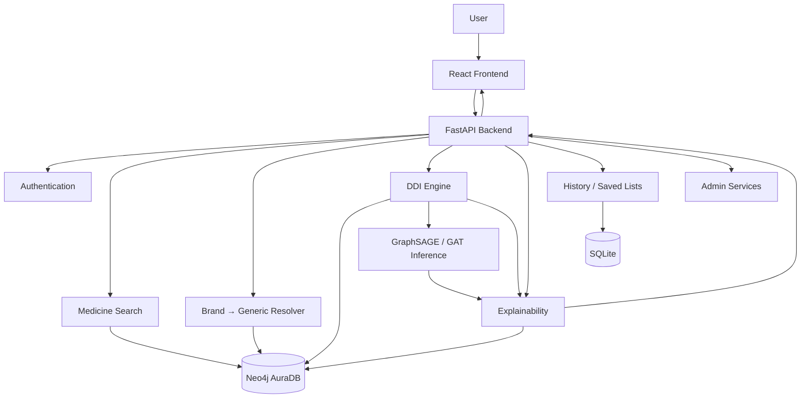

---

# 2. Architectural Principles

## 2.1 Evidence First

The Knowledge Graph is the primary source for documented interactions.

The GNN is a fallback for suitable pairs that are not found in the documented KG.

```text
KG evidence
    ↓
if documented → evidence-backed result

if not documented
    ↓
validated GNN
    ↓
AI-predicted result
```

A model prediction must never be represented as a documented database interaction.

---

## 2.2 Uncertainty Must Be Visible

The system must distinguish:

```text
Exact brand match
High-confidence fuzzy match
Low-confidence match
Unresolved medicine
Documented interaction
No documented interaction
GNN prediction
GNN unavailable
Database failure
```

These states must not be collapsed into one generic success/failure state.

---

## 2.3 Failure Must Not Become Safety

This is a critical architectural rule.

```text
Neo4j unavailable
       ≠
No interaction found
```

Likewise:

```text
GNN unavailable
       ≠
No interaction exists
```

---

# 3. System Context

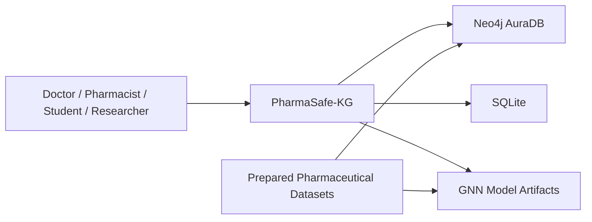

External systems and dependencies must be isolated behind application services wherever practical.

---

# 4. Frontend Architecture

## 4.1 Technology

Target frontend:

```text
React
TypeScript
Vite
Tailwind CSS
React Router
TanStack Query
Zustand
Axios
vis-network
Recharts
jsPDF
html2canvas
Lucide
```

---

## 4.2 Frontend Layers

```text
Pages
  ↓
Feature Components
  ↓
UI Components
  ↓
Hooks / State
  ↓
API Client
  ↓
FastAPI
```

Suggested structure:

```text
frontend/
├── src/
│   ├── app/
│   ├── pages/
│   ├── components/
│   ├── features/
│   │   ├── auth/
│   │   ├── medicines/
│   │   ├── ddi/
│   │   ├── history/
│   │   ├── patients/
│   │   └── admin/
│   ├── hooks/
│   ├── services/
│   ├── store/
│   ├── types/
│   └── utils/
```

---

## 4.3 Frontend Responsibilities

The frontend is responsible for:

- user interaction
- validation for user experience
- displaying search results
- displaying resolved ingredients
- collecting selected medicines
- displaying DDI results
- rendering severity
- rendering explanations
- rendering graph visualization
- authentication UI
- history UI
- saved lists
- admin UI

The frontend must **not** independently implement clinical interaction logic.

The backend remains the source of truth for DDI results.

---

# 5. Backend Architecture

## 5.1 Technology

```text
Python 3.11
FastAPI
Pydantic
Uvicorn
Neo4j Python Driver
SQLAlchemy
SQLite
JWT
slowapi
cachetools
```

---

## 5.2 Backend Layers

```text
API Routes
    ↓
Request/Response Schemas
    ↓
Application Services
    ↓
Domain Logic
    ↓
Repositories / Adapters
    ↓
Neo4j / SQLite / ML
```

Suggested structure:

```text
backend/
├── app/
│   ├── main.py
│   ├── api/
│   │   ├── auth.py
│   │   ├── search.py
│   │   ├── ddi.py
│   │   ├── drugs.py
│   │   ├── history.py
│   │   ├── patients.py
│   │   ├── feedback.py
│   │   └── admin.py
│   ├── schemas/
│   ├── services/
│   │   ├── resolver.py
│   │   ├── ddi_engine.py
│   │   ├── severity.py
│   │   ├── xai.py
│   │   └── gnn_service.py
│   ├── repositories/
│   │   ├── neo4j.py
│   │   └── sqlite.py
│   ├── models/
│   ├── core/
│   └── ml/
└── tests/
```

The exact directory structure should be reconciled with the existing repository before refactoring. AI agents must not blindly recreate this structure if an equivalent implementation already exists.

---

# 6. Authentication Architecture

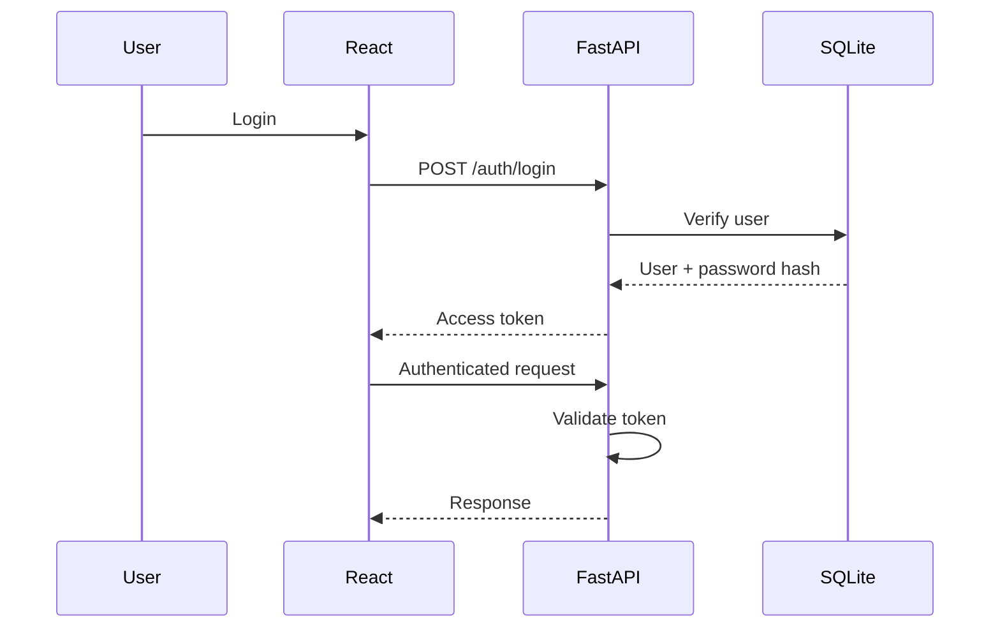

Authentication is separate from the clinical DDI engine.

Authorization is enforced at the API layer.

---

# 7. Medicine Resolution Architecture

This is one of the most important pipelines in PharmaSafe-KG.

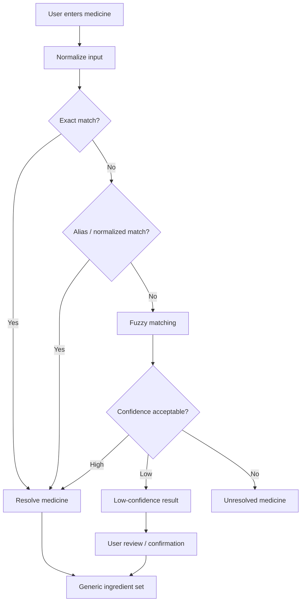

The resolver should return structured metadata:

```json
{
  "input": "brand entered by user",
  "canonical_brand": "resolved brand",
  "ingredients": [],
  "match_type": "exact|normalized|alias|fuzzy",
  "confidence": 0.0,
  "review_required": false
}
```

The exact field names must match the final API contract.

---

# 8. Polypharmacy Architecture

For `N` selected medicines:

```text
number of unique pairs = N × (N - 1) / 2
```

Example:

```text
3 medicines → 3 pairs
4 medicines → 6 pairs
10 medicines → 45 pairs
```

The system should resolve all medicines first, then generate unique ingredient/medicine pairs.

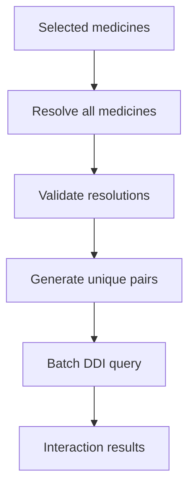

The backend should prefer batch database access over one database call per pair.

---

# 9. DDI Engine Architecture

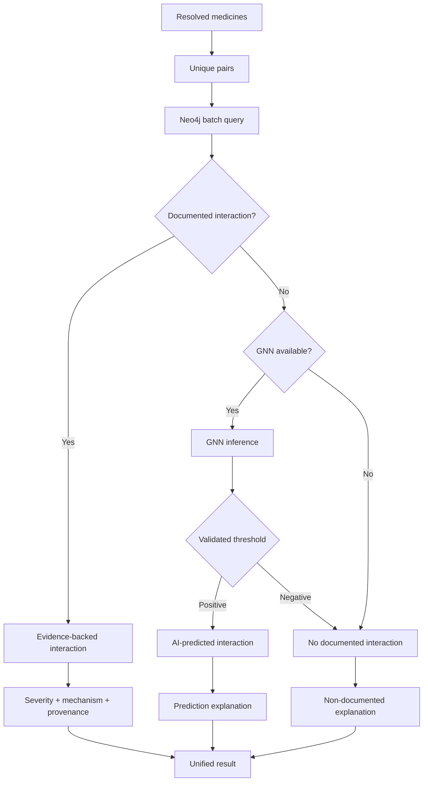

---

# 10. Knowledge Graph Architecture

The documented graph uses the conceptual structure:

```text
Drug
  ↓ CONTAINS
Ingredient
  ↓ INTERACTS_WITH
Ingredient
  ↑ CONTAINS
Drug
```

This enables:

```text
Brand/Drug
    ↓
Ingredient
    ↓
Interaction
    ↓
Other Ingredient
    ↓
Other Drug
```

The current project documentation reports approximately:

```text
2,073 Ingredient nodes
48,000 Drug nodes
100,000 interaction edges
71,512 CONTAINS relationships
```

These values describe the documented current state and must not be assumed to remain unchanged after data rebuilding.

---

# 11. Neo4j Responsibilities

Neo4j is responsible for:

- medicine/ingredient relationships
- ingredient interaction relationships
- interaction severity
- mechanism/evidence where stored
- graph traversal
- graph visualization data
- graph-based search

Neo4j should not be used as a replacement for the application user database.

---

# 12. SQLite Responsibilities

SQLite is intended for application-level data such as:

```text
users
sessions/token-related data where applicable
history
saved lists
feedback
admin metadata
```

The exact schema must be defined in `DATA-DICTIONARY.md` / database migrations.

Clinical graph facts should remain in the Knowledge Graph rather than being duplicated unnecessarily in SQLite.

---

# 13. GNN Architecture

The project contains GraphSAGE/GAT research components.

Conceptual pipeline:

```text
Neo4j graph
    ↓
Graph export
    ↓
Node/edge features
    ↓
Leakage-free split
    ↓
Training
    ↓
Validation
    ↓
Model artifact
    ↓
Inference service
```

Runtime architecture:

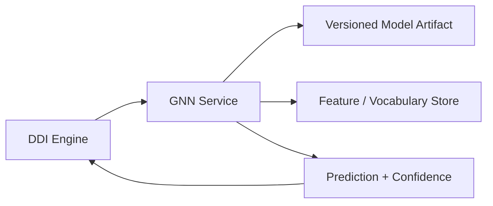

The existing trained model must not automatically be treated as production-ready.

Production inference requires:

- validated model
- versioned artifact
- known vocabulary
- feature compatibility
- threshold
- calibration if applicable
- OOV handling
- monitoring

---

# 14. GNN Decision Boundary

The system must distinguish:

```text
Documented
```

from:

```text
AI predicted
```

A unified result object should conceptually contain:

```json
{
  "status": "documented|predicted|not_documented|unavailable",
  "severity": "MAJOR|MODERATE|MINOR|null",
  "confidence": null,
  "mechanism": null,
  "evidence": [],
  "model": null,
  "model_version": null
}
```

The exact production schema must be defined in the API specification.

---

# 15. Explainability Architecture

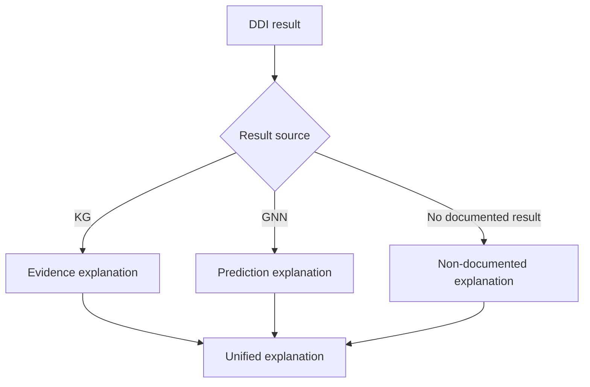

## Documented explanation

Should explain:

```text
Entered medicine
→ resolved ingredient
→ interacting ingredient
→ interacting medicine
→ severity
→ mechanism
→ evidence/source
```

## Predicted explanation

Should explain:

```text
Medicine pair
→ model prediction
→ probability/confidence
→ model/version
→ prediction disclaimer
```

The system must not invent a pharmacological mechanism from a GNN probability.

---

# 16. Results Architecture

The results page consumes a unified backend response.

Conceptually:

```text
Check response
├── request metadata
├── resolved medicines
├── pair count
├── documented interactions
├── predicted interactions
├── non-documented pairs
├── unresolved medicines
└── system warnings
```

This allows the UI to accurately communicate uncertainty.

---

# 17. History Architecture

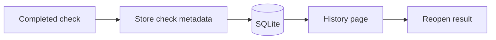

History should preserve enough information to identify:

- medicines checked
- timestamp
- result summary
- application/model version where required
- relevant resolution information

If patient-identifying information is stored, privacy and retention requirements must be explicitly implemented.

---

# 18. Saved Medicine / Patient List Architecture

Conceptually:

```text
User
 └── Saved Lists
      ├── List A
      │    ├── Medicine 1
      │    └── Medicine 2
      └── List B
           ├── Medicine 3
           └── Medicine 4
```

The initial implementation should avoid storing unnecessary patient-identifying information.

---

# 19. Admin Architecture

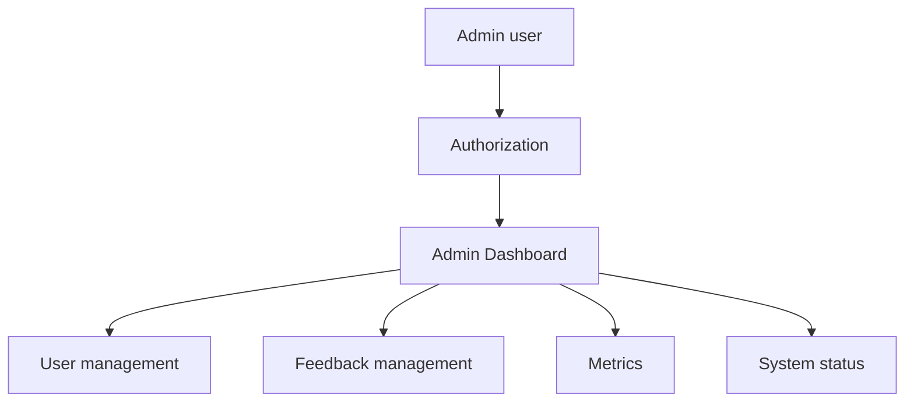

Admin operations must be isolated from normal user operations.

---

# 20. API Architecture

The frontend must communicate with the backend through a defined API contract.

Conceptual groups:

```text
/auth/*
/search
/check
/drug/*
/graph
/user/history
/user/patients
/feedback
/admin/*
/health
/status
```

The API specification should be maintained separately in:

```text
PHARMASAFE-KG-API-SPEC.md
```

The API contract is the source of truth for request/response formats.

---

# 21. Error Architecture

All layers must preserve error meaning.

```text
Validation error
       ↓
400

Authentication failure
       ↓
401

Authorization failure
       ↓
403

Resource not found
       ↓
404

Rate limit
       ↓
429

Dependency/database failure
       ↓
5xx

Successful request with no documented DDI
       ↓
200 + explicit non-documented status
```

A database failure must never return an ordinary empty interaction list as though the query succeeded.

---

# 22. Caching Architecture

Caching may be used for:

- autocomplete
- frequently searched medicines
- static graph metadata
- validated model artifacts

Caching must not cause stale clinical interaction information to appear without an appropriate version/refresh strategy.

The cache must be invalidated when relevant graph/data versions change.

---

# 23. Data Pipeline Architecture

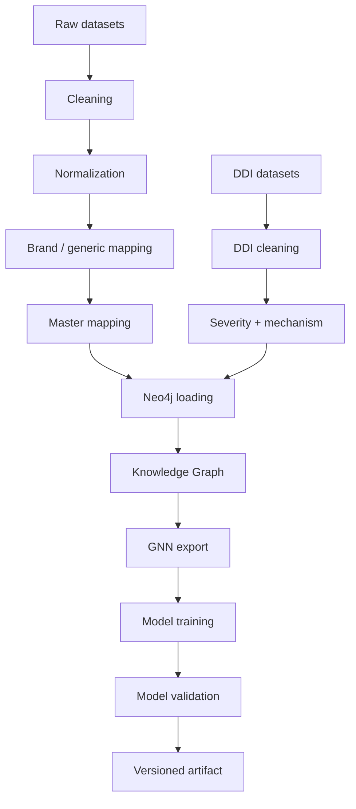

---

# 24. Data Provenance

Important pharmaceutical facts should retain provenance wherever the source data supports it.

Conceptually:

```text
Fact
 ├── source
 ├── source_id
 ├── dataset_version
 ├── imported_at
 └── processing_version
```

This is particularly important for:

- interaction severity
- mechanism
- brand mapping
- model training data

---

# 25. Security Architecture

```text
Browser
   ↓ HTTPS
React
   ↓ HTTPS
FastAPI
   ├── Authentication
   ├── Authorization
   ├── Validation
   ├── Rate limiting
   └── Logging
       ↓
Neo4j / SQLite
```

Secrets must be supplied through environment/configuration management.

Never hard-code:

```text
Neo4j passwords
JWT secrets
API keys
database credentials
```

---

# 26. Deployment Architecture

Target deployment:

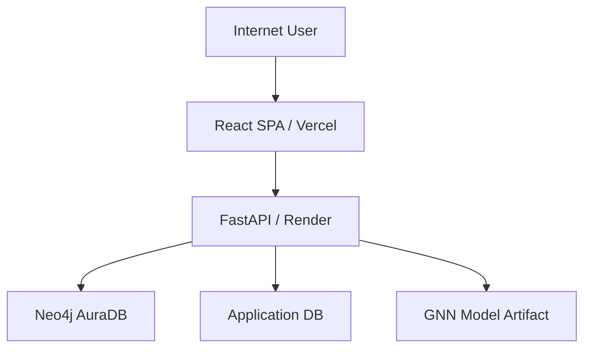

The exact hosting provider may change, but the separation of frontend, API, graph database and application data should remain clear.

---

# 27. Development Architecture for AI Agents

AI coding agents are first-class development tools for this project.

Agents should work through:

```text
Repository
   ↓
CURRENT-STATE
   ↓
ISSUES
   ↓
PRD
   ↓
ARCHITECTURE
   ↓
ROADMAP
   ↓
Implementation
   ↓
Tests
   ↓
Documentation update
```

An agent must inspect the actual repository before deciding whether a component is missing.

---

# 28. Source-of-Truth Hierarchy

When documents and code disagree:

```text
Running/source code
        ↓
Automated tests
        ↓
Current-state verification
        ↓
Architecture documentation
        ↓
PRD
        ↓
Planning documents
```

However, research methodology changes require explicit human/project approval rather than silently choosing whichever source is easiest to implement.

---

# 29. Current Architecture vs Target Architecture

## Current documented state

```text
Streamlit UI
      ↓
FastAPI
      ↓
Neo4j
```

with:

```text
GNN training artifacts
XAI logic
data pipelines
```

but not all components are connected into one production flow.

The documented project state reports that the GNN is trained but disconnected from the API.

## Target

```text
React
  ↓
FastAPI
  ├── Resolver
  ├── DDI Engine
  ├── XAI
  ├── Auth
  ├── History
  └── GNN inference
       ↓
Neo4j + SQLite + model artifacts
```

---

# 30. Critical Architectural Constraints

### Constraint 1

Do not rewrite the Knowledge Graph simply to change the UI.

### Constraint 2

Do not move clinical graph facts into SQLite without a clear architectural reason.

### Constraint 3

Do not make the GNN the primary DDI source.

### Constraint 4

Do not label an absent KG interaction as safe.

### Constraint 5

Do not expose low-confidence brand resolution as authoritative.

### Constraint 6

Do not expose model predictions as documented interactions.

### Constraint 7

Do not change the ML evaluation methodology merely to obtain better metrics.

### Constraint 8

Do not introduce credentials into source control.

### Constraint 9

Do not make frontend-only clinical decisions.

### Constraint 10

Every major architecture change must be reflected in the architecture documentation.

---

# 31. Performance Architecture

Primary optimization target:

```text
One request
   ↓
Resolve medicines
   ↓
Generate pairs
   ↓
Batch Neo4j query
   ↓
GNN only for eligible missing pairs
   ↓
Build unified response
```

Avoid:

```text
for every pair:
    open DB connection
    query Neo4j
    close DB connection
```

Prefer connection pooling and batch queries.

Performance must be evaluated using:

```text
p50
p95
p99
```

rather than only one average response time.

---

# 32. Observability Architecture

The system should expose:

```text
/health
/status
```

and internally track:

```text
request latency
Neo4j latency
GNN inference latency
resolver latency
error rates
request volume
```

Critical failures should be distinguishable from ordinary "no interaction" responses.

---

# 33. Architecture Decision Records

Major decisions should eventually be recorded as ADRs.

Example:

```text
docs/adr/
├── ADR-001-neo4j-as-ddi-graph.md
├── ADR-002-kg-first-ddi-strategy.md
├── ADR-003-gnn-fallback-strategy.md
├── ADR-004-react-migration.md
└── ADR-005-authentication-strategy.md
```

An ADR should state:

```text
Context
Decision
Alternatives
Consequences
Status
```

This is optional for the first implementation phase but highly useful as the project grows.

---

# 34. Architecture Validation Checklist

Before declaring an architectural change complete:

- [ ] Existing implementation inspected
- [ ] Dependencies identified
- [ ] Data flow still valid
- [ ] API contract preserved or updated
- [ ] Security implications checked
- [ ] Error states preserved
- [ ] Tests updated
- [ ] Performance considered
- [ ] Research methodology preserved
- [ ] Documentation updated

---

# 35. Final Architecture Model

The intended PharmaSafe-KG architecture is:

```text
                    USER
                      │
                      ▼
              ┌──────────────┐
              │    React     │
              │  Web Client  │
              └──────┬───────┘
                     │ HTTPS
                     ▼
              ┌──────────────┐
              │   FastAPI    │
              └──────┬───────┘
                     │
        ┌────────────┼─────────────┐
        ▼            ▼             ▼
   ┌─────────┐ ┌──────────┐ ┌──────────┐
   │ Resolver│ │ DDI      │ │   Auth   │
   │ Service │ │ Engine   │ │ Service  │
   └────┬────┘ └────┬─────┘ └────┬─────┘
        │           │             │
        │           │             ▼
        │           │          SQLite
        │           │
        ▼           ▼
     ┌───────────────────┐
     │    Neo4j AuraDB   │
     │ Knowledge Graph   │
     └─────────┬─────────┘
               │
               │ KG miss
               ▼
        ┌──────────────┐
        │ GNN Service  │
        │ GraphSAGE/   │
        │ GAT          │
        └──────┬───────┘
               │
               ▼
        ┌──────────────┐
        │ Explainability│
        │    Layer      │
        └──────┬───────┘
               │
               ▼
             React
```

The architectural objective is not simply to connect more components. It is to maintain a clear separation between:

```text
DATA
KNOWLEDGE
INFERENCE
APPLICATION LOGIC
EXPLANATION
PRESENTATION
```

while preserving provenance and uncertainty throughout the entire pipeline.
