# PharmaSafe-KG — Frontend UI/UX Redesign Specification
**Document Version:** 2.0.0 (Production Specification)  
**Target Stack:** Next.js (App Router), React 19, TypeScript 5, Tailwind CSS v4, Framer Motion, Lucide Icons, vis-network / Cytoscape.js  
**Base Backend Checkpoint:** `v1.0-p1-verified` (`c2a0079`)  
**Design Aesthetic:** Light Theme Only, Clinical Healthcare / Scientific Research Grade, High-Density Information Hierarchy, Accessible (WCAG 2.1 AA)

---

## 1. Executive Summary & Design Principles

PharmaSafe-KG is an academic and clinical research platform providing explainable drug-drug interaction (DDI) detection for Indian commercial brand medications. The system combines an Indian brand-to-generic knowledge graph (Neo4j AuraDB) with an inductive Graph Neural Network (GraphSAGE) for missing-link prediction.

### Core Visual Principles
1. **Light Theme Only:** A clinical, clean, high-contrast, trustworthy palette built around medical slate, clinical cyan/teal, deep navy, and distinct semantic alert colors. Dark mode, glowing neon borders, cyberpunk aesthetics, and speculative AI marketing gradients are strictly prohibited.
2. **Restrained, Scientific Aesthetic:** Clean lines, subtle borders, high typographic clarity, structured data tables, and distinct clinical badges.
3. **Rigorous Epistemic Separation:** The interface must maintain an unambiguous distinction between:
   - **Documented Evidence (Knowledge Graph):** Clinically documented, peer-reviewed interaction mechanisms with assigned severity (`MAJOR`, `MODERATE`, `MINOR`).
   - **AI Predicted Interaction (GraphSAGE Link Prediction):** Statistical graph topological predictions with confidence percentages ($\ge 70\%$) and severity marked explicitly as `UNKNOWN` / `UNASSESSED`.
   - **No Documented DDI:** Explicitly labeled as `"No Documented DDI"` accompanied by a mandatory clinical disclaimer that absence of evidence is not proof of clinical safety.
4. **Deterministic Demo Flow vs. Production Clinical Flow:** The application provides a standalone, presenter-guided demonstration suite for academic defense and research presentations, completely isolated from normal patient medication analysis.

---

## 2. Forensic Codebase Inspection & Guaranteed Backend Contracts

### 2.1 Live Backend Endpoint Contract (FastAPI `phase3/app/main.py`)

| HTTP Method | Route | Auth | Request Body / Parameters | Response Model | Status Codes | Streamlit Used? | Next.js Target Purpose |
|---|---|---|---|---|---|:---:|---|
| `GET` | `/` / `/health` | None | None | `HealthResponse` | `200 OK` | Direct (`GET`) | System status banner, connection health checks, footer diagnostics |
| `GET` | `/search` | None | `q: str` (1–100 chars, required)<br>`limit: int` (1–50, default: 10) | `SearchResponse` | `200 OK`, `422 Unprocessable` | Yes (`api_search`) | Real-time drug autocomplete input with debouncing |
| `POST` | `/check` | None | `CheckRequest`: `{"drugs": ["Name1", "Name2", ...]}` (2–10 drugs) | `CheckResponse` | `200 OK`, `422 Unprocessable`, `500 Server Error` | Yes (`api_check`) | Core polypharmacy interaction analysis engine |
| `GET` | `/drug/{brand_name}` | None | `brand_name: str` (path param) | `DrugInfoResponse` | `200 OK`, `404 Not Found`, `500 Server Error` | No (available) | Dedicated Drug Monograph page (`/drugs/[name]`) |
| `GET` | `/graph` | None | `drugs: list[str]` (query param, $\ge 2$ required) | `GraphResponse` | `200 OK`, `422 Unprocessable`, `500 Server Error` | Yes (`api_graph`) | Interactive network visualization (`/graph` and inline results) |
| `GET` | `/docs` / `/redoc` | None | None | HTML / OpenAPI JSON | `200 OK` | External link | Embedded developer & research documentation |

### 2.2 Detailed Pydantic Schema Specifications

#### `POST /check` Request (`CheckRequest`)
```typescript
interface CheckRequest {
  drugs: string[]; // Min length 2, Max length 10. Automatically trimmed.
}
```

#### `POST /check` Response (`CheckResponse`)
```typescript
interface ResolvedDrug {
  input: string;           // e.g. "Combiflam"
  matched_brand: string;   // e.g. "Combiflam"
  generics: string[];      // e.g. ["ibuprofen", "paracetamol"]
  match_type: "exact" | "fuzzy" | "alias" | "generic_direct" | "not_found";
  confidence: number;      // 0 - 100
  review_required: boolean;// true if fuzzy match confidence < threshold
}

interface EvidenceItem {
  source_id?: string;
  source?: string;
  mechanism?: string;
  severity?: string;
  model?: string;          // "GraphSAGE" for predictions
  probability?: number;    // e.g. 0.884
  threshold?: number;      // 0.70
  evidence_type?: string;  // "inductive_link_prediction"
}

interface InteractionResult {
  brand_a: string;
  brand_b: string;
  ingredient_a: string;
  ingredient_b: string;
  severity: "MAJOR" | "MODERATE" | "MINOR" | "UNKNOWN" | "UNASSESSED";
  mechanism: string;
  explanation: string;
  status: "documented" | "predicted";
  source: "knowledge_graph" | "gnn_predicted";
  confidence: number | null; // Float 0.000 - 1.000 for predicted, null for documented
  evidence: EvidenceItem[];
}

interface SafePair {
  brand_a: string;
  brand_b: string;
  note: string;
  status: "not_documented";
}

interface CheckResponse {
  total_drugs: number;
  brand_names: string[];
  pairs_checked: number;
  interactions_found: number;
  safe_pairs: number;
  summary: string;
  interactions: InteractionResult[];
  safe_pairs_detail: SafePair[];
  resolved_drugs: ResolvedDrug[];
}
```

#### `GET /drug/{brand_name}` Response (`DrugInfoResponse`)
```typescript
interface DrugInteractionItem {
  interacting_ingredient: string;
  severity: "MAJOR" | "MODERATE" | "MINOR";
  mechanism: string;
}

interface DrugInfoResponse {
  brand_name: string;
  generics: string[];
  total_known_ddis: number;
  major_count: number;
  moderate_count: number;
  minor_count: number;
  interactions: DrugInteractionItem[];
}
```

#### `GET /graph?drugs=...` Response (`GraphResponse`)
```typescript
interface GraphNode {
  id: string;              // e.g. "drug_Combiflam" or "ing_ibuprofen"
  label: string;           // Display name
  type: "Drug" | "Ingredient";
  color: string;           // Hex code (e.g. "#2563EB" or "#10B981")
  size: number;            // Radius (e.g. 15 or 25)
}

interface GraphEdge {
  from: string;            // Node ID
  to: string;              // Node ID
  label: string;           // e.g. "CONTAINS" or "MAJOR"
  color: string;           // Hex code
  width: number;           // Edge stroke width (1 - 4)
  title?: string;          // Tooltip mechanism description
  severity?: string;
}

interface GraphResponse {
  nodes: GraphNode[];
  edges: GraphEdge[];
}
```

---

## 3. Audit of Existing Streamlit UX & Identified Bottlenecks

### 3.1 Existing Streamlit Implementation Analysis
- **Dark Theme Locking:** Hardcoded `#0F1117` background with dark glowing gradient borders which fails clinical readability standards.
- **Fragmented Autocomplete Flow:** Text input relies on Streamlit button reruns (`st.rerun()`) causing jarring UI re-renders and loss of focus during typing.
- **Single-Page Clutter:** Input controls, drug pills, results summary, severity cards, safe pair expanders, and Pyvis HTML iframe are stacked vertically in a single 2-column view with excessive scrolling.
- **Lack of Multi-Page Navigation:** No separate Drug Monograph inspection, Methodology/About documentation, or dedicated Presentation Demo mode.
- **Missing State Persistence:** Refreshing the browser window clears all selected drugs and calculated interaction results.

---

## 4. Design System (Light Theme Clinical Architecture)

### 4.1 Color System (WCAG 2.1 AA Compliant)

```css
:root {
  /* Surface & Background */
  --bg-app: #F8FAFC;              /* Slate-50: Main application canvas */
  --bg-surface: #FFFFFF;          /* White: Cards, panels, modals */
  --bg-surface-elevated: #FFFFFF; /* Dropdown menus, popovers */
  --bg-subtle: #F1F5F9;           /* Slate-100: Table headers, code blocks */

  /* Borders & Dividers */
  --border-subtle: #E2E8F0;       /* Slate-200: Standard container borders */
  --border-strong: #CBD5E1;       /* Slate-300: Active inputs, table borders */
  --border-focus: #0284C7;        /* Sky-600: High-visibility focus ring */

  /* Typography */
  --text-primary: #0F172A;        /* Slate-900: Headings, high-emphasis text */
  --text-secondary: #334155;      /* Slate-700: Body copy, labels */
  --text-muted: #64748B;          /* Slate-500: Helper text, timestamps */
  --text-disabled: #94A3B8;       /* Slate-400: Inactive states */

  /* Brand / Primary Clinical Action */
  --primary: #0284C7;             /* Sky-600: Primary actions, active tabs */
  --primary-hover: #0369A1;       /* Sky-700: Button hover */
  --primary-light: #E0F2FE;       /* Sky-100: Selection badges, chip backgrounds */
  --primary-text: #075985;        /* Sky-800: High-contrast text on primary-light */

  /* Semantic Severity: MAJOR (Red / Critical) */
  --severity-major-bg: #FEF2F2;    /* Red-50 */
  --severity-major-border: #FCA5A5;/* Red-300 */
  --severity-major-accent: #DC2626;/* Red-600 */
  --severity-major-text: #991B1B;  /* Red-800 */

  /* Semantic Severity: MODERATE (Amber / Warning) */
  --severity-mod-bg: #FFFBEB;      /* Amber-50 */
  --severity-mod-border: #FCD34D;  /* Amber-300 */
  --severity-mod-accent: #D97706;  /* Amber-600 */
  --severity-mod-text: #92400E;    /* Amber-800 */

  /* Semantic Severity: MINOR (Emerald / Low Risk) */
  --severity-min-bg: #F0FDF4;      /* Green-50 */
  --severity-min-border: #86EFAC;  /* Green-300 */
  --severity-min-accent: #16A34A;  /* Green-600 */
  --severity-min-text: #166534;    /* Green-800 */

  /* Evidence Source: AI Predicted (Indigo/Violet Accent) */
  --source-pred-bg: #F5F3FF;       /* Purple-50 */
  --source-pred-border: #D8B4FE;   /* Purple-300 */
  --source-pred-accent: #7E22CE;   /* Purple-700 */
  --source-pred-text: #581C87;     /* Purple-900 */

  /* Evidence Source: Documented Knowledge Graph (Teal) */
  --source-kg-bg: #ECFDF5;         /* Emerald-50 */
  --source-kg-border: #6EE7B7;     /* Emerald-300 */
  --source-kg-accent: #059669;     /* Emerald-600 */
  --source-kg-text: #065F46;       /* Emerald-800 */

  /* Status: No Documented DDI (Neutral Slate) */
  --safe-bg: #F8FAFC;              /* Slate-50 */
  --safe-border: #CBD5E1;          /* Slate-300 */
  --safe-text: #475569;            /* Slate-600 */
}
```

### 4.2 Typography Hierarchy
- **Font Stack:** Inter, system-ui, -apple-system, sans-serif. Monospace for identifiers/hashes: `JetBrains Mono`, `ui-monospace`.
- `Display (H1)`: 28px (1.75rem), Weight: 700, Tracking: -0.02em, Line-height: 1.2
- `Section (H2)`: 20px (1.25rem), Weight: 600, Tracking: -0.01em, Line-height: 1.3
- `Card Heading (H3)`: 16px (1.0rem), Weight: 600, Line-height: 1.4
- `Body Text`: 14px (0.875rem), Weight: 400, Line-height: 1.5
- `Labels / Metas`: 12px (0.75rem), Weight: 500, Tracking: 0.02em
- `Badges / Chips`: 11px (0.6875rem), Weight: 600, Text-transform: uppercase

### 4.3 Spacing & Elevation
- **Spacing Scale:** 4px, 8px, 12px, 16px, 24px, 32px, 48px, 64px.
- **Border Radius:** `sm: 4px`, `md: 6px`, `lg: 8px`, `xl: 12px`, `pill: 9999px`.
- **Shadows:**
  - `shadow-subtle`: `0 1px 2px 0 rgba(0, 0, 0, 0.05)`
  - `shadow-card`: `0 1px 3px 0 rgba(0, 0, 0, 0.1), 0 1px 2px -1px rgba(0, 0, 0, 0.1)`
  - `shadow-modal`: `0 10px 15px -3px rgba(0, 0, 0, 0.1), 0 4px 6px -4px rgba(0, 0, 0, 0.1)`

---

## 5. Page Architecture & Route Specification

```
app/
├── (public)/
│   ├── page.tsx                    # Landing page (Research Overview & Capabilities)
│   ├── about/
│   │   └── page.tsx                # Methodology, GNN Architecture & Data Provenance
│   └── demo/
│       └── page.tsx                # Controlled Academic Presentation Mode
├── (auth)/
│   ├── login/
│   │   └── page.tsx                # Clinical Portal Sign In (UI Ready / Mock Mode)
│   ├── register/
│   │   └── page.tsx                # Researcher Registration (UI Ready / Mock Mode)
│   └── forgot-password/
│       └── page.tsx                # Password Recovery (UI Ready / Mock Mode)
├── (workspace)/
│   ├── layout.tsx                  # Workspace Shell with TopNav & Status Banner
│   ├── dashboard/
│   │   └── page.tsx                # Medication Workbench & Recent Query History
│   ├── analyze/
│   │   └── page.tsx                # Dedicated Multi-Drug Input & Resolution Wizard
│   ├── results/
│   │   └── page.tsx                # Full DDI Analysis Hierarchy & Clinical Report
│   ├── drugs/
│   │   └── [name]/
│   │       └── page.tsx            # Drug Monograph & Single-Ingredient Profiler
│   ├── graph/
│   │   └── page.tsx                # Full-screen Interactive Knowledge Graph Explorer
│   └── profile/
│       └── page.tsx                # Researcher Settings & Offline Cache Preferences
└── layout.tsx                      # Root Layout (Fonts, QueryProvider, ToastProvider)
```

### 5.1 Route Details

#### 1. `/` (Public Landing Page)
- **Purpose:** Academic project showcase, value proposition for Indian medicine polypharmacy, summary of the 50,073-node Knowledge Graph and GraphSAGE architecture.
- **Key Components:** Hero section with clinical interactive preview, statistics ticker (304,000+ brands, 92,161 interactions, 88.34% test AUC), architecture flowchart, CTA to `/analyze` or `/demo`.

#### 2. `/about` (Methodology & Provenance)
- **Purpose:** Formal documentation of data pipelines (DrugBank + Indian Brand Catalog), leakage-free GNN benchmark results (Table 1 & Table 2 from IEEE draft), and Model Card specifications.

#### 3. `/demo` (Controlled Academic Defense Mode)
- **Purpose:** 100% deterministic, click-through slide/scenario engine designed for thesis defense presentations without relying on ad-hoc typing.
- **Presets:**
  1. *Warfarin Polypharmacy Scenario* (`Warfarin` + `Combiflam` + `Pantop 40`) $\rightarrow$ Illustrates MAJOR bleed risk.
  2. *Cardiovascular Regimen* (`Atorva 10` + `Ecosprin` + `Metolar XR`) $\rightarrow$ Illustrates dual antiplatelet/statin synergy.
  3. *GNN AI Prediction Scenario* $\rightarrow$ Displays inductive link prediction with confidence score and `UNKNOWN` severity.
  4. *5-Drug Complex Regimen* $\rightarrow$ Full 10-pair combinatorial evaluation.

#### 4. `/analyze` (Interactive Clinical Workbench)
- **Purpose:** Primary working interface for entering 2–10 drugs, real-time debounced autocomplete search, instant ingredient resolution chip inspection, and launching `/check`.

#### 5. `/results` (Hierarchical Clinical Interaction Report)
- **Purpose:** Deep explanation of detected interactions with strict visual grouping:
  - Top: Statistical Summary Banner (Total Drugs, Pairs Checked, Documented DDIs, AI Predictions, Safe Pairs).
  - Group 1: High-Risk Documented Interactions (`MAJOR` - Red).
  - Group 2: Moderate Documented Interactions (`MODERATE` - Amber).
  - Group 3: Minor Documented Interactions (`MINOR` - Green).
  - Group 4: Inductive Link Predictions (`AI PREDICTED` - Purple, `UNKNOWN` severity).
  - Group 5: Non-Interacting Combinations (`NO DOCUMENTED DDI` - Neutral with clinical disclaimer).
  - Bottom: Interactive Pyvis/Cytoscape topological subgraph and Export PDF/JSON button.

#### 6. `/drugs/[name]` (Single Drug Monograph)
- **Purpose:** In-depth monograph for any Indian brand or generic ingredient showing all known interactions in Neo4j AuraDB, matched generics, and manufacturer data.

#### 7. `/graph` (Dedicated Topological Explorer)
- **Purpose:** Full-page interactive 2D canvas with physics controls, node filtering (Brand vs Ingredient), edge filtering (Major/Moderate/Minor/Predicted), search-to-focus, and node inspection sidebar.

---

## 6. Normal Clinical User Flow vs. Academic Presentation Demo Flow

```mermaid
flowchart TD
    subgraph NormalFlow["Normal Clinical User Flow"]
        A[Landing / Dashboard] --> B[Enter 2-10 Drugs in /analyze]
        B --> C[Real-Time Autocomplete & Resolution]
        C --> D[POST /check API Call]
        D --> E[Render /results View]
        E --> F[Inspect Evidence Accordions & Subgraph]
    end

    subgraph DemoFlow["Academic Presentation Demo Flow (/demo)"]
        G[Open /demo] --> H[Select Preset Clinical Scenario]
        H --> I[Step 1: Clinical Case Presentation]
        I --> J[Step 2: Automated Brand Resolution]
        J --> K[Step 3: Documented KG Evidence Breakdown]
        K --> L[Step 4: GNN Inductive Link Prediction]
        L --> M[Step 5: Interactive Subgraph Topology]
        M --> N[Step 6: Research Metric & Model Card Summary]
    end
```



---

## 7. Component Architecture Specification

```
components/
├── layout/
│   ├── Navbar.tsx                  # Clean header with navigation links & API Health indicator
│   ├── Footer.tsx                  # University, author credits, and IEEE citation link
│   ├── StatusBanner.tsx            # Live backend connectivity & AuraDB status badge
│   └── PageContainer.tsx           # Standardized responsive page wrapper
├── drugs/
│   ├── DrugSearchBar.tsx           # Debounced input with keyboard dropdown navigation
│   ├── DrugChip.tsx                # Deletable badge showing brand name & resolved generics
│   ├── DrugResolutionCard.tsx      # Explains brand -> generic mapping type (exact/fuzzy/alias)
│   └── PresetSelector.tsx          # Quick-load buttons for standard clinical combinations
├── interactions/
│   ├── SeverityBadge.tsx           # High-contrast MAJOR / MODERATE / MINOR / UNKNOWN badge
│   ├── SourceBadge.tsx             # DOCUMENTED EVIDENCE vs 🤖 AI PREDICTED badge
│   ├── InteractionCard.tsx         # Primary severity-bordered card with mechanism & evidence
│   ├── EvidenceAccordion.tsx       # Expandable multi-evidence records and literature links
│   ├── SafePairCard.tsx            # Clean slate card for combinations without documented DDI
│   └── ResultsSummaryBanner.tsx    # High-density statistical summary bar
├── graph/
│   ├── NetworkGraph.tsx            # Interactive canvas (Cytoscape.js or vis-network)
│   ├── GraphControls.tsx           # Zoom, fit, physics toggle, and export PNG buttons
│   └── GraphLegend.tsx             # Node/edge color key
├── demo/
│   ├── ScenarioStepper.tsx         # Step-by-step presentation progress bar
│   ├── ScenarioExplanation.tsx     # Clinical teaching points for defense committee
│   └── MetricComparisonTable.tsx   # Side-by-side Table 2 (GraphSAGE vs GAT)
└── common/
    ├── Button.tsx                  # Primary, Secondary, Outline, Danger, Icon variants
    ├── Card.tsx                    # Surface card with optional left accent border
    ├── Skeleton.tsx                # Loading placeholder for cards and tables
    ├── Toast.tsx                   # Accessible feedback notifications
    └── Modal.tsx                   # Accessible focus-trapped dialog
```

---

## 8. Frontend ↔ Backend API Mapping Matrix

| Page / Component | Trigger / Event | Backend API Route | Request Payload | Response Handling | UI State Transition |
|---|---|---|---|---|---|
| `StatusBanner.tsx` | App Mount / 30s Polling | `GET /health` | None | Parse `status`, `neo4j`, `gnn_loaded`, `brands_loaded` | Green pill ("Connected") or Red pill ("API Offline") |
| `DrugSearchBar.tsx` | User types $\ge 2$ characters (250ms debounce) | `GET /search` | `q={query}&limit=10` | Set dropdown suggestions list | Displays autocomplete popover with highlighted search term |
| `analyze/page.tsx` | "Check Interactions" button click | `POST /check` | `{"drugs": ["Brand1", "Brand2", ...]}` | Cache result in context / query state, navigate to `/results` | Transition with loading skeleton $\rightarrow$ `/results` view |
| `results/page.tsx` | Direct load with cached query | `POST /check` | `{"drugs": ["Brand1", "Brand2", ...]}` | Render summary, severity cards, and safe pairs | Staggered entrance animation for interaction cards |
| `NetworkGraph.tsx` | Mount in `/graph` or inline in `/results` | `GET /graph` | `drugs=Brand1&drugs=Brand2...` | Populate graph nodes & edges in canvas | Interactive network with physics stabilization |
| `drugs/[name]/page.tsx` | Page load with brand slug | `GET /drug/{name}` | Path param: `brand_name` | Render generic ingredients, interaction stats & table | Detailed monograph card with severity breakdown |

---

## 9. Comprehensive User Journey & Edge Case Handling (22 Scenarios)

1. **First-Time Visitor:** Lands on `/`, views research overview, clicks "Launch Analyzer", taken to `/analyze` with helpful placeholder hints.
2. **Real-Time Autocomplete:** User types `"Combi"` $\rightarrow$ `GET /search?q=Combi` returns `["Combiflam", "Combiflam Suspension", "Combimycin"]` in $< 50\text{ms}$.
3. **Adding Duplicate Drug:** User attempts to add `"Combiflam"` twice $\rightarrow$ Toast notification: *"Combiflam is already in your medication list."*
4. **Selecting Fuzzy-Matched Brand:** User enters mis-spelled brand `"Dolo650"` $\rightarrow$ Backend resolves with `match_type: "fuzzy"`, UI displays an amber confirmation chip: *"Matched to Dolo 650 (92% confidence)"*.
5. **Direct Generic Input:** User enters `"warfarin"` $\rightarrow$ Resolved via `match_type: "generic_direct"`, tagged with a green generic badge.
6. **Unknown / Unresolvable Drug:** User enters `"FakeDrugXYZ"` $\rightarrow$ Highlighted in red: *"Unable to resolve to an active generic ingredient."* Check button is disabled until corrected.
7. **Under Minimum Limit ($< 2$ drugs):** Check button remains disabled with helper tooltip: *"Add at least 2 medications to check interactions."*
8. **Over Maximum Limit ($> 10$ drugs):** Input field is disabled with message: *"Maximum 10 medications supported per analysis."*
9. **Analysis Loading State:** User clicks "Check Interactions" $\rightarrow$ Skeleton loading cards appear with pulsating animation, button displays spinner.
10. **Documented MAJOR Interaction:** Displayed with red left border (`#DC2626`), red badge (`🔴 MAJOR`), clear brand header (`Combiflam ↔ Ecosprin`), active ingredients tag (`ibuprofen ↔ aspirin`), and medical mechanism summary.
11. **Documented MODERATE Interaction:** Displayed with amber left border (`#D97706`), amber badge (`🟡 MODERATE`).
12. **Documented MINOR Interaction:** Displayed with green left border (`#16A34A`), green badge (`🟢 MINOR`).
13. **GNN-Predicted Interaction:** Displayed with purple left border (`#7E22CE`), purple badge (`🤖 AI PREDICTED`), confidence score (e.g. `84.5% Confidence`), severity marked as `UNKNOWN (Unassessed)`, with explanation: *"GraphSAGE inductive link prediction suggests high topological interaction likelihood."*
14. **No Documented Interaction (Safe Pair):** Displayed in a collapsible clean slate card: `"No documented interaction in current knowledge base."` with disclaimer: *"Lack of documented evidence does not guarantee clinical safety."*
15. **Multi-Ingredient Combination:** Brand `"Combiflam"` (ibuprofen + paracetamol) tested against `"Ecosprin"` (aspirin) evaluates all 4 cross-ingredient combinations in parallel and groups findings under the brand pair.
16. **Multiple Evidence Records:** For drug pairs with both DrugBank and literature citations, an "Evidence Sources" accordion expands to show all distinct records.
17. **Graph Interaction:** User clicks a node in the graph $\rightarrow$ Highlights connected edges, dims unrelated nodes, and displays an ingredient inspection drawer.
18. **Network Offline / API Unavailable:** Top banner turns red: *"FastAPI backend offline (`http://localhost:8000`). Run `uvicorn phase3.app.main:app` to reconnect."*
19. **Neo4j AuraDB Paused / Error:** Backend returns 500 $\rightarrow$ UI renders error modal: *"Knowledge Graph database connection timed out. Please check AuraDB instance status."*
20. **GNN Weights Missing:** Health endpoint reports `gnn_loaded: false` $\rightarrow$ UI functions normally for documented interactions but displays an informational badge: *"AI link prediction in fallback mode."*
21. **Single Drug Monograph Lookup:** User navigates to `/drugs/Combiflam` $\rightarrow$ Displays total interaction count, severity bar chart, and searchable table of all interacting generics.
22. **Exporting Clinical Summary:** User clicks "Export PDF Report" on `/results` $\rightarrow$ Generates a print-optimized, clean white clinical summary sheet with disclaimer and date.

---

## 10. Framer Motion Animation Guidelines

To maintain an uncluttered clinical aesthetic, animations must be rapid, subtle, and functional:

```typescript
// Standard motion tokens
export const transitions = {
  page: { duration: 0.2, ease: [0.25, 0.1, 0.25, 1.0] },
  cardEntrance: { duration: 0.25, ease: "easeOut" },
  stagger: 0.04,
};

export const cardVariants = {
  hidden: { opacity: 0, y: 8 },
  visible: (i: number) => ({
    opacity: 1,
    y: 0,
    transition: { delay: i * transitions.stagger, ...transitions.cardEntrance },
  }),
};
```
- **Accessibility Rule:** All motion components must wrap in `@media (prefers-reduced-motion: reduce)` or use Framer Motion's `useReducedMotion()` hook to immediately set animations to `opacity: 1` with 0 duration.

---

## 11. Responsive Breakpoints & Accessibility (WCAG 2.1 AA)

### 11.1 Breakpoint Matrix
- **Mobile ($< 640\text{px}$):** Single-column stacked layout. Search bar sticky at top. Bottom navigation bar for mobile. Subgraph rendered with fixed height ($320\text{px}$) and touch-pan enabled.
- **Tablet ($640\text{px} - 1024\text{px}$):** 2-column layout on `/analyze` (Input 40%, Preview 60%). Graph and results occupy full container width.
- **Desktop ($\ge 1024\text{px}$):** Multi-column workbench layout with sidebar status and sticky right-side interaction inspector.

### 11.2 Accessibility Checklist
- **Color Contrast:** All text elements meet a minimum contrast ratio of `4.5:1` against their backgrounds (`7:1` for body text).
- **Keyboard Navigation:** Full tab-stop index through search autocomplete, suggestion chips, clear buttons, and expandable evidence accordions.
- **ARIA Tags:**
  - `role="combobox"` on drug search input with `aria-expanded`, `aria-controls="drug-suggestions"`.
  - `role="alert"` on severity warnings.
  - `aria-live="polite"` on results counter and status banners.

---

## 12. Authentication Gap Analysis

| Feature | Current Backend State | Required Backend Additions | Required Frontend Additions |
|---|---|---|---|
| **User Registration** | `MISSING` (No user table or auth routes) | Add SQLite / Postgres user schema, `/auth/register` route, bcrypt password hashing | `RegisterForm.tsx`, client-side Zod validation |
| **User Login & JWT** | `MISSING` (No token issuance) | Add `/auth/login` (OAuth2 Password Bearer), JWT generation, refresh token cookies | `LoginForm.tsx`, AuthContext, Token interceptor |
| **Password Reset** | `MISSING` (No mailer service) | Add `/auth/forgot-password` and `/auth/reset-password` tokenized endpoints | `ForgotPasswordForm.tsx`, `ResetPasswordForm.tsx` |
| **Protected Analysis History** | `MISSING` (Queries are stateless) | Add `UserQueryHistory` table in relational DB, link query records to `user_id` | User dashboard history table, saved regimens |
| **Frontend Auth Architecture** | `READY FOR MOCK / MODULAR INTEGRATION` | None needed for initial clinical demo (stateless mode operates without auth) | LocalStorage fallback session provider allowing instant login bypass for grading |

---

## 13. Docker & Deployment Architecture

```
┌─────────────────────────────────────────────────────────────┐
│                       Client Browser                        │
└──────────────────────────────┬──────────────────────────────┘
                               │ HTTP / HTTPS (Port 3000)
                               ▼
┌─────────────────────────────────────────────────────────────┐
│                 Next.js Frontend Container                  │
│  - Static Asset Optimization                                │
│  - Server Components & Client Hydration                     │
│  - Reverse Proxy /api/* -> FastAPI backend                  │
└──────────────────────────────┬──────────────────────────────┘
                               │ HTTP (Port 8000)
                               ▼
┌─────────────────────────────────────────────────────────────┐
│                  FastAPI Backend Container                  │
│  - Python 3.11 + Uvicorn                                    │
│  - PyTorch GNN Runtime (In-Memory Embeddings)               │
│  - Brand Resolver (304k In-Memory Table)                    │
└──────────────────────────────┬──────────────────────────────┘
                               │ Bolt / TLS (Port 7687)
                               ▼
┌─────────────────────────────────────────────────────────────┐
│                    Neo4j AuraDB (Cloud)                     │
│  - 50,073 Nodes (2,073 Ingredients + 48,000 Drugs)          │
│  - 160,879 Relationships (89,367 DDI + 71,512 CONTAINS)     │
└─────────────────────────────────────────────────────────────┘
```

### Environment Configuration (`.env.local`)
```env
# Frontend Environment
NEXT_PUBLIC_API_BASE_URL=http://localhost:8000
NEXT_PUBLIC_APP_ENV=development
NEXT_PUBLIC_ENABLE_DEMO_MODE=true

# Backend Environment (Reference)
NEO4J_URI=neo4j+s://<instance_id>.databases.neo4j.io
NEO4J_USERNAME=neo4j
NEO4J_PASSWORD=<password>
CORS_ORIGINS=http://localhost:3000,http://localhost:8501
```

---

## 14. Implementation Roadmap (Phased Execution)

1. **Step 1: Next.js Project Initialization & Design Tokens**
   - Initialize Next.js (App Router, TypeScript, Tailwind CSS, Lucide icons, Framer Motion).
   - Configure Tailwind color palette matching Section 4.
2. **Step 2: API Client Layer & State Management**
   - Create typed API client (`lib/api.ts`) connecting to existing FastAPI endpoints (`/health`, `/search`, `/check`, `/drug/{name}`, `/graph`).
3. **Step 3: Core Interactive Workbench (`/analyze` & `/results`)**
   - Implement `DrugSearchBar` with debouncing and keyboard navigation.
   - Implement `ResultsSummaryBanner`, `InteractionCard`, `SeverityBadge`, and `EvidenceAccordion`.
4. **Step 4: Academic Presentation Demo Mode (`/demo`)**
   - Build `ScenarioStepper` and load the 4 predefined thesis demonstration scenarios.
5. **Step 5: Drug Monograph (`/drugs/[name]`) & Graph Explorer (`/graph`)**
   - Implement single-drug lookup page.
   - Embed interactive network graph using Cytoscape.js or vis-network.
6. **Step 6: Public Showcase & Methodology (`/` & `/about`)**
   - Build Landing and About pages showcasing model architecture and Table 1/2 research metrics.
7. **Step 7: Verification & Test Suite**
   - Verify all routes, responsiveness, accessibility, and zero-regression backend contract tests.
